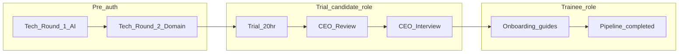
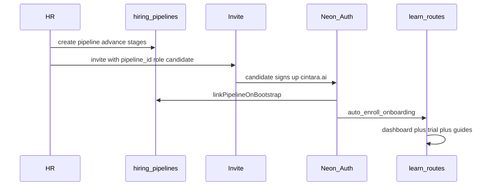

# Alyson Training — Platform Context

> **Purpose of this document:** Give any LLM (or engineer) a complete technical picture of the Alyson Training platform — what it does, how it is built, what works today, what is hardcoded, what is missing, and the internal patterns to follow when planning or implementing changes.
>
> **Repo:** `Alyson-Training-Project` · **Package:** `alyson-training` v1.0.0 · **Origin:** TanStack Start template (`tanstack_start_ts_2026-05-29`, see `.lovable/project.json`)

---

## Table of Contents

1. [Platform Overview](#1-platform-overview)
2. [Tech Stack](#2-tech-stack)
3. [Directory Structure](#3-directory-structure)
4. [Routing & Pages](#4-routing--pages)
5. [Server Architecture](#5-server-architecture)
6. [Internal Code Patterns](#6-internal-code-patterns)
7. [Authentication & Authorization](#7-authentication--authorization)
8. [Database (Neon PostgreSQL)](#8-database-neon-postgresql)
9. [Email System (AWS SES)](#9-email-system-aws-ses)
10. [AI Integration](#10-ai-integration)
11. [Asset Storage](#11-asset-storage)
12. [Training LMS Features](#12-training-lms-features)
13. [Assessment System](#13-assessment-system)
14. [Interview & Hiring System](#14-interview--hiring-system)
15. [Environment Variables](#15-environment-variables)
16. [Scripts & Operational Commands](#16-scripts--operational-commands)
17. [Deployment & Infrastructure](#17-deployment--infrastructure)
18. [Hardcoded Values & Magic Strings](#18-hardcoded-values--magic-strings)
19. [Working vs Missing / Incomplete](#19-working-vs-missing--incomplete)
20. [Known Quirks & Technical Debt](#20-known-quirks--technical-debt)
21. [Planning Checklist for New Work](#21-planning-checklist-for-new-work)
22. [User Panel — Planning Guide](#22-user-panel--planning-guide)
23. [Unified New Joiner & Hiring Pipeline](#23-unified-new-joiner--hiring-pipeline)

---

## 1. Platform Overview

**Alyson Training** is an internal LMS and hiring assessment platform for **Cintara** (`@cintara.ai` domain only). It combines employee training workflows with a **unified new-joiner hiring pipeline** (tech interviews → trial → CEO review → onboarding) in one app.

### Primary user personas

| Persona | Role key | Primary surfaces |
|---------|----------|------------------|
| **Student / Trainee** | `trainee` | `/learn/dashboard`, `/learn/guide/*`, `/learn/assignments` — onboarding guides + assessments |
| **Trial candidate** | `candidate` | `/learn/dashboard`, `/learn/trial`, `/learn/guide/*` — trial project + core onboarding (DocsLearnLayout) |
| **Creator / Trainer** | `trainer` | Admin console (courses, classes, assessments, assignments) minus admin-only routes |
| **Hiring Manager** | `hiring_manager` | `/hiring/pipeline`, `/interviews`, `/hiring/reports`, `/analytics` |
| **CEO** | `ceo` | Read-only executive view: `/`, `/analytics`, `/hiring/*`, `/interviews` |
| **Admin** | `admin` | Full admin console including users, invites, settings, notifications |
| **External interviewee** | *(no auth)* | Public `/interview/$token` — magic-link interview test (pre-account tech rounds) |

### Core feature areas

| Area | What it does |
|------|--------------|
| **Courses & Classes** | Multi-step class creation wizard with AI syllabus assistant; sections with video/docs; bulk Excel import |
| **Assessments** | MCQ + subjective test builder, templates, publish workflow, learner assignments & attempts |
| **Interviews** | Schedule candidate sessions, magic-link delivery, AI evaluation, paper-only mode, HR notes, audit bundles |
| **Hiring Pipeline** | End-to-end new-joiner journey: kanban board, stage progression, trial projects, CEO review/interview, convert to trainee |
| **Onboarding (learner)** | Docs-style guides for core courses (AI Builder, Business Process) + department role tracks; auto-enrollment on hire |
| **Hiring Reports** | Aggregated hiring metrics for managers/CEO |
| **Admin** | User management, invite system, analytics dashboard, email templates/schedules, email testing |
| **Notifications** | AWS SES transactional email with Postgres queue, cron-driven reminders/escalations |

### Unified new-joiner journey (high level)



Full technical detail: [§23 Unified New Joiner & Hiring Pipeline](#23-unified-new-joiner--hiring-pipeline).

### Dual-surface architecture (admin vs user panel)

The app is **one codebase, multiple shells** — not separate apps:

| Surface | Layout | Route prefix | Primary personas |
|---------|--------|--------------|------------------|
| **Admin console** | `AdminLayout` (`components/admin/AdminLayout.tsx`) | `/`, `/courses`, `/hiring/pipeline`, … | `admin`, `trainer`, `hiring_manager`, `ceo` |
| **Docs learner panel** | `DocsLearnLayout` inside `LearnLayout` (`routes/learn.tsx`) | `/learn/*` | `candidate`, `trainee`; staff in **student mode** |
| **Interview portal** | None (standalone page) | `/interview/$token` | External candidates (no auth) |
| **Test taking** | None (standalone page) | `/attempt/$assignmentId` | Learner taking an assigned assessment |

**Integration glue:** `ViewModeProvider` (`lib/view-mode.tsx`) persists `creator` \| `student` in `localStorage` key `alyson-view-mode`. Both shells expose a mode toggle; switching to student mode navigates to `/learn`, and the learn footer links back to `/` (admin) when in creator mode.

### Post-auth routing

- `candidate`-only or `trainee`-only → `/learn/dashboard`
- `hiring_manager`-only → `/interviews`
- `ceo`-only → `/hiring/reports`
- Everyone else with roles → `/` (admin dashboard)
- No roles → `NoAccessPanel` (invite required)
- Defined in `src/lib/auth-constants.ts` → `postAuthHomePath()`
- Learner-only users (`isLearnerOnly()` in `role-access.ts`) are blocked from admin routes and redirected to `/learn/*`

---

## 2. Tech Stack

| Layer | Technology | Version / Notes |
|-------|------------|-----------------|
| **Framework** | TanStack Start | `@tanstack/react-start` ^1.167 |
| **UI** | React 19 | SPA + SSR via Start |
| **Bundler** | Vite 7 | Dev port **5173** |
| **Server runtime** | Nitro 3 beta | `nitro/vite` plugin |
| **Routing** | TanStack Router | File-based routes in `src/routes/`, auto-generated `src/routeTree.gen.ts` |
| **Data fetching** | TanStack React Query v5 | `useQuery` / `useMutation` + `useServerFn` |
| **Styling** | Tailwind CSS 4 | `@tailwindcss/vite` plugin |
| **UI components** | shadcn/ui (Radix) | `src/components/ui/*`, config in `components.json` |
| **Icons** | Lucide React | |
| **Charts** | Recharts | Dashboard, analytics, difficulty charts |
| **Toasts** | Sonner | |
| **Forms** | react-hook-form + Zod | `@hookform/resolvers` |
| **DnD** | @dnd-kit | Test builder question reordering |
| **Database** | Neon PostgreSQL | Dual access: Data API (browser) + direct `pg` pool (server) |
| **Auth** | Neon Auth | Google SSO + email/password, JWT via `jose` |
| **Email** | AWS SES v2 | `@aws-sdk/client-sesv2`, `@react-email/components` |
| **AI** | DeepSeek API + OpenRouter | Class generation, question gen, interview grading, paper OCR |
| **Documents** | mammoth, pdfjs-dist, marked, xlsx, jspdf | DOCX/PDF/MD parsing, Excel bulk import, PDF export |
| **Fonts** | @fontsource/inter | Loaded in `__root.tsx` |
| **TypeScript** | strict mode | Path alias `@/*` → `./src/*` |
| **Lint/format** | ESLint 9 + Prettier | |
| **Package manager** | npm (also has `bun.lock` / `bunfig.toml`) | Scripts use npm |

---

## 3. Directory Structure

```
Alyson-Training-Project/
├── context.md                 # This file
├── db/                        # SQL schemas (apply manually via npm scripts)
│   ├── hiring-pipeline.sql    # Unified pipeline tables + candidate role
│   └── onboarding-seeds.sql   # Core onboarding course seeds
├── docs/                      # AUTH, DEPLOYMENT, NEON_SETUP, AWS_SES_SETUP
├── infra/                     # EventBridge cron setup guide
├── scripts/                   # 33+ operational .mjs scripts
├── storage/                   # Local asset files (runtime; Docker volume mount)
├── src/
│   ├── routes/                # File-based pages + API handlers (43 route files)
│   ├── components/
│   │   ├── admin/             # AdminLayout, AIClassAssistant, email editors, bulk import
│   │   ├── auth/              # NoAccessPanel
│   │   ├── hiring/            # PipelineBoard, pipeline UI
│   │   ├── interview/         # InterviewExtendedPanels
│   │   ├── learn/             # DocsLearnLayout (docs-style sidebar)
│   │   ├── test-builder/      # TestBuilder, QuestionEditor, DifficultyChart
│   │   └── ui/                # shadcn primitives (~30 components)
│   ├── lib/                   # Business logic
│   │   ├── ai/                # LLM calls, material extraction
│   │   ├── email/             # SES, queue, cron, templates, triggers
│   │   ├── hiring/            # Hiring reports
│   │   ├── hiring-pipeline/   # Pipeline CRUD, stages, trial, CEO review, convert
│   │   ├── interview/         # Sessions, evaluation, paper grading, audit
│   │   └── onboarding/        # Onboarding nav + enrollment server fns
│   ├── integrations/neon/     # Auth client, middleware, generated types
│   ├── hooks/                 # use-mobile.tsx
│   ├── assets/                # alyson-logo.svg
│   ├── server.ts              # Production fetch entry
│   ├── start.ts               # Middleware registration
│   ├── routeTree.gen.ts       # AUTO-GENERATED — do not hand-edit
│   └── styles.css             # Tailwind + design tokens
├── Dockerfile                 # Node 20 Alpine, port 4173
├── .env.example               # Env template (never commit .env)
├── Intructions.md             # Paper-only HR workflow (filename has typo)
├── components.json            # shadcn config
├── package.json
├── tsconfig.json
└── vite.config.ts
```

### `src/lib/` file suffix conventions

| Suffix | Runs where | Purpose | Example |
|--------|------------|---------|---------|
| `*.functions.ts` | Server (callable from client) | TanStack `createServerFn` endpoints | `auth.functions.ts` |
| `*.server.ts` | Server only | SQL, SES, AI, file I/O — never import in client components | `assessments.server.ts` |
| `*.shared.ts` | Client + server | Types, Zod schemas, pure helpers | `class-bulk-import.shared.ts` |
| `*-api.ts` | Client | TypeScript types + fetch/query helpers | `assessments-api.ts` |
| `*.validation.ts` | Shared | Zod input schemas | `class-create.validation.ts` |

### Naming conventions

- Server functions: `*Fn` suffix (`bootstrapAuthUser`, `listInterviewSessionsFn`)
- DB operations: `*FromDb` / `*InDb` (`getAssessmentFromDb`, `createInterviewSessionInDb`)
- Middleware: `requireDbAuth`, `requireContentManager`
- React Query keys: domain-scoped (`["classes", "counts"]`, `["email-settings"]`)

---

## 4. Routing & Pages

Routes are file-based under `src/routes/`. TanStack Router plugin generates `src/routeTree.gen.ts` — **regenerated on build/dev, do not edit manually**.

### Public routes (no AdminLayout)

| Path | File | Notes |
|------|------|-------|
| `/auth` | `auth.tsx` | Sign-in/sign-up; search params: `mode`, `email`, `token` |
| `/interview/$token` | `interview.$token.tsx` | Candidate interview portal (token auth, no session) |

### Admin console routes (wrapped in `AdminLayout`)

| Path | File | Purpose |
|------|------|---------|
| `/` | `index.tsx` | Dashboard with metrics |
| `/analytics` | `analytics.tsx` | Analytics charts |
| `/assignments` | `assignments.tsx` | Assign tests to learners |
| `/users` | `users.tsx` | User management (admin only) |
| `/invites` | `invites.tsx` | Invite management (admin only) |
| `/settings` | `settings.tsx` | Workspace/integration settings (admin only) |
| `/email-testing` | `email-testing.tsx` | Manual email sends (admin only) |
| `/classes/new` | `classes.new.tsx` | Multi-step class creation wizard |
| `/classes/$classId` | `classes.$classId.tsx` | Class editor (sections, assets) |
| `/hiring/reports` | `hiring.reports.tsx` | Hiring reports |
| `/hiring/pipeline` | `hiring.pipeline.index.tsx` | Hiring pipeline kanban + filters |
| `/hiring/pipeline/$pipelineId` | `hiring.pipeline.$pipelineId.tsx` | Pipeline detail: schedule rounds, trial, CEO review, hire |
| `/attempt/$assignmentId` | `attempt.$assignmentId.tsx` | Learner/admin test attempt |

### Nested layout routes (parent renders `<Outlet />`)

| Parent | Children |
|--------|----------|
| `/courses` | `/courses/` (index), `/courses/$courseId` |
| `/assessments` | `/assessments/`, `/assessments/builder`, `/assessments/templates`, `/assessments/$assessmentId/preview` |
| `/interviews` | `/interviews/`, `/interviews/$sessionId` |
| `/notifications` | `/notifications/`, `/notifications/templates`, `/notifications/schedules` |
| `/learn` | `/learn/`, `/learn/dashboard`, `/learn/guide/$courseId/$sectionId`, `/learn/assignments`, `/learn/trial`, `/learn/courses`, `/learn/courses/$courseId/study` |

### User panel routes (LearnLayout + DocsLearnLayout — not AdminLayout)

| Path | File | Purpose | Backend |
|------|------|---------|---------|
| `/learn` | `learn.index.tsx` | Legacy assignment list (redirects or coexists with dashboard) | `listMyAssignmentsFn` |
| `/learn/dashboard` | `learn.dashboard.tsx` | Onboarding hub — core guides + role tracks | `getOnboardingNavFn` |
| `/learn/guide/$courseId/$sectionId` | `learn.guide.$courseId.$sectionId.tsx` | Docs-style guide reader | `getOnboardingNavFn`, section content |
| `/learn/assignments` | `learn.assignments.tsx` | Assessment assignments | `listMyAssignmentsFn` |
| `/learn/trial` | `learn.trial.tsx` | Trial project brief + submission (`candidate` only in nav) | `getMyTrialProjectFn`, `submitTrialProjectFn` |
| `/learn/courses` | `learn.courses.tsx` | Legacy course catalog (department-scoped) | `listMyCoursesFn` |
| `/learn/courses/$courseId/study` | `learn.courses.$courseId.study.tsx` | Legacy card-based study flow | `getCourseStudyCardsFn`, `recordStudyActivityFn` |

**Standalone learner route (outside LearnLayout):**

| Path | File | Notes |
|------|------|-------|
| `/attempt/$assignmentId` | `attempt.$assignmentId.tsx` | Full test UI; links back to assignments informally; no shared learner chrome |

**Learn layout behavior** (`learn.tsx`):

- Auth required; redirects to `/auth` if unauthenticated
- Wraps child routes in `DocsLearnLayout` — sidebar: Dashboard, guide tree (from onboarding nav), Assessments, Trial (when `isCandidateOnly`)
- `canAccessLearnRoute(roles)` — any user with ≥1 workspace role; learner-only users blocked from admin via `isLearnerOnly()`
- Header: logo + sign out; footer (non-learner-only): student/creator mode toggle + "Admin console" link

### API routes

| Method + Path | File | Auth mechanism |
|---------------|------|----------------|
| `POST /api/internal/cron/tick` | `api/internal/cron/tick.ts` | `Bearer CRON_SECRET` |
| `POST /api/internal/email/process` | `api/internal/email/process.ts` | Cron secret |
| `POST /api/internal/assets/upload` | `api/internal/assets/upload.ts` | Bearer JWT + content manager |
| `POST /api/internal/assets/delete` | `api/internal/assets/delete.ts` | Bearer JWT + content manager |
| `GET /api/assets/$` (splat) | `api/assets/$.ts` | HMAC signed URLs in production |
| `POST /api/webhooks/ses` | `api/webhooks/ses.ts` | SNS signature verification |
| `POST /api/public/hooks/daily-reminders` | `api/public/hooks/daily-reminders.ts` | Cron secret (legacy) |
| `POST /api/public/hooks/escalations` | `api/public/hooks/escalations.ts` | Cron secret (legacy) |
| `POST /api/public/hooks/retry-failed` | `api/public/hooks/retry-failed.ts` | Cron secret (legacy) |
| `POST /api/public/hooks/weekly-summary` | `api/public/hooks/weekly-summary.ts` | Cron secret (legacy) |

**Preferred cron entry point:** unified `POST /api/internal/cron/tick` (replaces individual hooks).

### Layouts

| Layout | File | Responsibility |
|--------|------|----------------|
| **Root** | `__root.tsx` | HTML shell, QueryClient, ViewModeProvider, Toaster, 404/Error components |
| **Admin** | `components/admin/AdminLayout.tsx` | Sidebar nav, auth redirect, role-based route guard, badges |
| **Learn (user panel)** | `learn.tsx` + `DocsLearnLayout` | Docs-style sidebar, dashboard/guides/trial/assignments, creator/student mode toggle |

### Navigation items

Defined in `src/lib/admin-data.ts` → `NAV_ITEMS` (15 items). Filtered per role by `navItemsForRoles()` in `role-access.ts`.

---

## 5. Server Architecture

### Entry points

```
Request → src/server.ts (fetch handler)
       → assertProductionConfig() on startup
       → @tanstack/react-start/server-entry
       → Nitro middleware
       → src/start.ts middleware (attachDbAuth, errorMiddleware)
       → Route handler or server function
```

| File | Role |
|------|------|
| `src/server.ts` | Production `fetch` export; normalizes h3-swallowed SSR 500s to HTML error page |
| `src/start.ts` | `createStart()` — registers `attachDbAuth` (function middleware) + `errorMiddleware` (request middleware) |
| `vite.config.ts` | `tanstackStart({ server: { entry: "server" } })`, Nitro plugin, port 5173 |

### Server function pattern

```typescript
// src/lib/example.functions.ts
export const myFn = createServerFn({ method: "POST" })
  .middleware([requireDbAuth])
  .inputValidator(MySchema)
  .handler(async ({ data, context }) => {
    return doWorkInDb(context.userId, data); // delegates to *.server.ts
  });
```

Client usage:
```typescript
const fn = useServerFn(myFn);
const result = await fn({ data: { ... } });
```

### All `*.functions.ts` files (29)

| File | Domain |
|------|--------|
| `auth.functions.ts` | Bootstrap, roles |
| `classes.functions.ts` | Class CRUD (19 functions) |
| `class-create.functions.ts` | Class creation wizard |
| `class-finalize.functions.ts` | Finalize draft class |
| `class-ai.functions.ts` | AI syllabus chat |
| `class-bulk-import.functions.ts` | Bulk Excel import |
| `section-questions.functions.ts` | Section question management |
| `generate-questions.functions.ts` | AI question generation |
| `assessments.functions.ts` | Assessment CRUD (10 functions) |
| `templates.functions.ts` | Assessment templates |
| `assignments.functions.ts` | Assignment management (16 functions) |
| `attempt.functions.ts` | Test attempts |
| `learn.functions.ts` | Learner course study |
| `onboarding/onboarding.functions.ts` | Onboarding nav, guide content |
| `invites.functions.ts` | Invite CRUD (8 functions) |
| `users-metrics.functions.ts` | User metrics |
| `nav.functions.ts` | Nav badge counts |
| `dashboard-metrics.functions.ts` | Dashboard metrics |
| `dashboard-summary.functions.ts` | Dashboard summary |
| `asset.functions.ts` | Signed asset URLs |
| `email-testing.functions.ts` | Manual email testing |
| `email/email-settings.functions.ts` | Email settings (6 functions) |
| `email/email-templates.functions.ts` | Template CRUD (5 functions) |
| `email/schedules.functions.ts` | Cron schedule management |
| `email/send-template.functions.ts` | Send templated email |
| `email/triggers.functions.ts` | Manual trigger runs |
| `interview/interview.functions.ts` | Interview system (27 functions) |
| `hiring/hiring-reports.functions.ts` | Hiring reports |
| `hiring-pipeline/hiring-pipeline.functions.ts` | Hiring pipeline (create, list, stages, trial, CEO review, convert) |

### All `*.server.ts` files (40)

`auth-bootstrap.server.ts`, `auth-token.server.ts`, `pg.server.ts`, `config.server.ts`, `content-manager.server.ts`, `classes.server.ts`, `class-create.server.ts`, `class-bulk-import.server.ts`, `assessments.server.ts`, `assignments.server.ts`, `invites.server.ts`, `dashboard-metrics.server.ts`, `asset-storage.server.ts`, `asset-auth.server.ts`, `asset-signing.server.ts`, `sns-verify.server.ts`, `cron-auth.server.ts`, `ai/extract-material.server.ts`, `ai/section-material.server.ts`, `email/email-db.server.ts`, `email/email-settings.server.ts`, `email/email-metrics.server.ts`, `email/cron-runner.server.ts`, `email/triggers.server.ts`, `email/assignment-notify.server.ts`, `email/queue-process.server.ts`, `hiring/hiring-reports.server.ts`, `hiring-pipeline/hiring-pipeline.server.ts`, `onboarding/onboarding-nav.server.ts`, `interview/interview.server.ts`, `interview/interview-token.server.ts`, `interview/interview-email.server.ts`, `interview/interview-audit.server.ts`, `interview/interview-parse.server.ts`, `interview/assessment-version.server.ts`, `interview/ai-evaluate.server.ts`, `interview/profile-evaluate.server.ts`, `interview/paper-grade.server.ts`, `interview/paper-only-evaluate.server.ts`, `interview/evaluation-audit.server.ts`

**Pipeline note:** Hiring pipeline CRUD uses **direct `pg` pool** in `hiring-pipeline.server.ts` (system/admin actor pattern), same as interviews — not the Neon Data API client from `requireDbAuth` context.

### Auth token flow

1. **Client:** `attachDbAuth` middleware (`integrations/neon/auth-attacher.ts`) adds `Authorization: Bearer <jwt>` to all server function requests
2. **Server:** `userFromRequest()` (`auth-token.server.ts`) verifies JWT against Neon JWKS
3. **Domain gate:** `@cintara.ai` enforced server-side
4. **Context:** `requireDbAuth` injects `userId`, `user`, and a Neon Data API client (`db`/`supabase` alias) into server function context

### Error handling

| Mechanism | File | Behavior |
|-----------|------|----------|
| `errorMiddleware` | `start.ts` | `/api/*` → JSON 500; pages → HTML error page |
| `renderErrorPage()` | `error-page.ts` | Branded 500 HTML |
| `error-capture.ts` | consumed by `server.ts` | Captures errors swallowed by h3 into generic HTTPError |
| `formatErrorMessage()` | `format-error.ts` | Normalizes errors for UI toasts |
| `AccountSuspendedError` | `auth-bootstrap.server.ts` | Triggers sign-out on suspended profile |

---

## 7. Authentication & Authorization

### Auth provider: Neon Auth

- Sign-in methods: **Google SSO** + **email/password**
- Domain restriction: **`@cintara.ai` only** (`ALLOWED_EMAIL_DOMAIN` in `auth-constants.ts`)
- Client: `db` from `integrations/neon/client.ts` (browser Data API + Auth)
- Session hook: `useSession()` in `auth.ts`

### Bootstrap flow (on first authenticated load)

```
Sign in at /auth
  → useSession() reads Neon session
  → bootstrapAuthUser() server function
  → bootstrapUserAccount() in auth-bootstrap.server.ts:
      1. Upsert profiles row
      2. If existing roles → return them
      3. Else consume invite (by token from localStorage or email match)
      4. If invite role is candidate or trainee → linkPipelineOnBootstrap()
         (links hiring_pipelines.user_id, sets department, auto_enroll_onboarding())
      5. Else if email in BOOTSTRAP_ADMIN_EMAILS → grant admin + trainer
      6. Else → no roles → NoAccessPanel
  → fetchMyRoles() fallback if bootstrap returns empty
```



### Invite system

- Admin creates invites at `/invites`; pipeline detail can also send candidate invite via `sendCandidateInviteFn`
- Invite token stored in `localStorage` key `alyson_invite_token` during signup flow
- Invites table: `invites` (email, role, department, token, `pipeline_id`, accepted_at)
- Server: `invites.server.ts`, `invites.functions.ts`

### Workspace roles

Enum `app_role` in Postgres: `admin`, `trainer`, `trainee`, `hiring_manager`, `ceo`, `candidate`

| Role | UI label | Access pattern |
|------|----------|----------------|
| `admin` | Admin | All routes |
| `trainer` | Creator | All except admin-only prefixes |
| `trainee` | Student | `/learn/*` only (`isLearnerOnly`) |
| `candidate` | Trial candidate | `/learn/*` only (`isLearnerOnly`); provisional during trial/onboarding |
| `hiring_manager` | Hiring Manager | If no trainer: interviews + hiring + analytics only |
| `ceo` | CEO | If no admin/trainer/hiring_manager: `/`, `/analytics`, `/hiring/*`, `/interviews` |

**Learner-only helpers** (`role-access.ts`): `isCandidateOnly()`, `isTraineeOnly()`, `isLearnerOnly()` — users with only `candidate` and/or `trainee` roles are redirected away from admin routes to `/learn/*`.

### Admin-only route prefixes

```
/invites, /users, /email-testing, /settings, /notifications
```

Defined in `src/lib/role-access.ts` → `ADMIN_ONLY_PREFIXES`

### Access enforcement

- **Client-side only** in `AdminLayout.tsx` via `canAccessAdminRoute()` + `navItemsForRoles()`
- **Server-side** per server function via `requireDbAuth` / `requireContentManager` middleware
- **API routes** have their own auth (cron secret, JWT, SNS signature, HMAC)
- **No TanStack Router `beforeLoad` guards** on routes

### Content manager check

`assertContentManager()` in `content-manager.server.ts` — requires `admin`, `trainer`, or `hiring_manager` role. Used for course/class creation, asset uploads, AI features.

### Suspended accounts

`profiles.status !== 'active'` → `AccountSuspendedError` → forced sign-out.

### Legacy fields

- `profiles.clerk_user_id` — unused column from earlier auth provider (Clerk), no Clerk integration exists.

### Deprecated aliases (Supabase → Neon migration remnants)

| Old | New |
|-----|-----|
| `supabase` | `db` |
| `supabaseAdmin` | `dbAdmin` |
| `attachSupabaseAuth` | `attachDbAuth` |
| `requireSupabaseAuth` | `requireDbAuth` |
| `DeepSeekMessage` | `ChatMessage` |

---

## 8. Database (Neon PostgreSQL)

### Dual access pattern

| Access method | Used for | File |
|---------------|----------|------|
| **Neon Data API** (browser, RLS-enforced) | Client reads/writes via `db` client | `integrations/neon/client.ts` |
| **Direct Postgres** (`DATABASE_URL`, bypasses RLS) | Migrations, bootstrap, interviews, cron, admin SQL | `lib/pg.server.ts` |
| **Admin Data API** (`dbAdmin`) | Cron/webhooks without user JWT | `integrations/neon/client.server.ts` |

### Schema apply order (run once per Neon project)

```bash
npm run db:apply                  # db/neon-schema.sql
npm run db:apply-interview        # db/interview-sessions.sql
npm run db:apply-enterprise       # db/enterprise-assessment.sql
npm run db:apply-paper-only       # db/paper-only-assessment.sql
npm run db:apply-pipeline         # db/hiring-pipeline.sql
npm run db:apply-onboarding-seeds # db/onboarding-seeds.sql (core onboarding courses)
npm run db:apply-rls              # db/neon-rls-policies.sql
npm run db:apply-email-seeds      # scripts/apply-email-seeds.mjs
npm run db:apply-email-queue-fix  # db/fix-email-queue-functions.sql
```

**Note:** `scripts/db-apply-all.mjs` does **not** yet include `db:apply-pipeline` or `db:apply-onboarding-seeds` — apply those manually on fresh Neon projects.

Schema is **not auto-versioned** — track applied scripts in a runbook.

### Tables

**Profiles & access:** `profiles`, `user_roles`, `departments`, `invites` (includes `pipeline_id`)

**Content:** `courses` (includes `is_core_onboarding`), `course_departments`, `classes`, `sections`, `section_assets`, `section_questions`, `section_progress`, `ai_class_generation`

**Assessments:** `assessments`, `assessment_questions`, `assessment_templates`, `assessment_versions`, `assessment_version_questions`

**Learners:** `candidates`, `assessment_assignments`, `assessment_attempts`, `attempt_answers`, `question_flags`, `study_activity`

**Hiring pipeline:** `hiring_pipelines`, `pipeline_stages`, `trial_projects`, `onboarding_enrollments`

**Interviews:** `interview_sessions` (includes `pipeline_id`, `round_type`), `interview_evaluation_runs`, `interview_hr_notes`, `interview_question_flags`, `interview_supporting_scores`

**Email:** `email_templates`, `email_template_versions`, `notification_log`, `notification_schedules`, `email_send_log`, `email_send_state`, `suppressed_emails`, `email_unsubscribe_tokens`, `email_notifications`, `email_queue`

**Views (hide answers from learners):** `section_questions_safe`, `assessment_questions_safe`

### Pipeline stage keys vs UI labels

Defined in `src/lib/hiring-pipeline/hiring-pipeline.shared.ts`:

| DB key | UI label |
|--------|----------|
| `tech_round_1` | Tech Round 1 (AI) |
| `tech_round_2` | Tech Round 2 (Domain) |
| `trial_project` | Trial Project (~20hr) |
| `bill_review` | **CEO Review** (DB columns remain `bill_review_*`) |
| `ceo_interview` | CEO Interview |
| `onboarding` | Onboarding |
| `completed` | Completed |

Interview `round_type` values: `tech_round_1`, `tech_round_2`, `ceo_interview`.

### Onboarding seed courses

From `db/onboarding-seeds.sql` — courses with `is_core_onboarding = true`:

- "How to be an AI Builder"
- "Business Process"

Department role tracks use `course_departments` + `HIRING_ROLE_TO_DEPARTMENT` in `src/lib/departments.ts`.

### Seeded departments (hardcoded in SQL)

| Slug | Label |
|------|-------|
| `data_scientist` | Data Scientist |
| `product_manager` | Product Manager |
| `marketing` | Marketing |
| `engineer` | Engineer |
| `analyst` | Analyst |
| `affiliate` | Affiliate |
| `affiliate_manager` | Affiliate Manager |
| `data_architect` | Data Architect |
| `data_engineer` | Data Engineer |
| `hr` | HR |
| `operations` | Operations |
| `sales` | Sales |

Canonical labels also in `src/lib/departments.ts` → `DEPARTMENTS` and `HIRING_ROLE_TO_DEPARTMENT` (maps pipeline `target_role` to department for onboarding tracks).

### Schema defaults (hardcoded in SQL)

| Field | Default |
|-------|---------|
| Class test pass mark | 75% |
| Class test MCQ count | 15 |
| Class test subjective count | 5 |
| Assignment due date | 14 days from assign (trigger) |
| Course level | `Beginner` |
| Course role | `Data Scientist` |
| Class status | `draft` |
| Interview MCQ/subjective weights | 40% / 60% |

### RLS (`db/neon-rls-policies.sql`)

- Helper functions: `is_admin()`, `is_content_manager()`, `is_app_user()` (SECURITY DEFINER)
- `authenticated` role granted CRUD on public tables
- Content managers write courses/classes; app users read
- Email queue RPCs: `enqueue_email`, `read_email_batch`, `archive_email`, `delete_email`, `move_to_dlq`

### Generated types

`src/integrations/neon/types.ts` — `Database` type for Neon Data API queries.

---

## 9. Email System (AWS SES)

### Provider config

| Setting | Value | Configurable? |
|---------|-------|---------------|
| From address | `training.group@cintara.ai` | **No** — hardcoded in `email/constants.ts` |
| From display name | `Cintara Training` | Yes — `SES_FROM_NAME` env |
| SES config set | `alyson-training` | Yes — `SES_CONFIGURATION_SET` env |
| Region | `us-east-1` | Yes — `AWS_REGION` env |

### Queue architecture

- Postgres `email_queue` table + RPC functions (replaces pgmq)
- Processor: `processEmailQueue()` in `email/process-queue.ts`
- Max retries: **5**; failed messages moved to DLQ via `move_to_dlq`
- Dev convenience: `EMAIL_AUTO_PROCESS=1` drains queue immediately after enqueue

### Cron system

**Unified tick:** `POST /api/internal/cron/tick` → `runCronTick()` (`email/cron-runner.server.ts`)

On each tick:
1. Evaluates `notification_schedules` (UTC cron via `cron-parser`)
2. Runs due jobs: `reminder_daily`, `escalation`, `weekly_ceo_summary`
3. Runs `retry_failed` (always)
4. Drains email queue

**External cron required** — Neon does not support `pg_cron`. Setup guides:
- `infra/eventbridge-email-cron.md` (AWS EventBridge, every 5 min)
- `scripts/configure-cron.md` (legacy per-hook curl examples)

### Email templates

- Stored in `email_templates` + `email_template_versions` tables
- Render: `renderTemplate()` in `email/render.ts` (Markdown → HTML via `marked`)
- Admin UI: `/notifications/templates` (`EmailTemplateEditor.tsx`)

**Supported placeholders:**

| Key | Description |
|-----|-------------|
| `{learner_name}` | Learner name |
| `{course_name}` | Course name |
| `{assignment_name}` | Assignment name |
| `{due_date}` | Due date |
| `{current_score}` | Current score |
| `{retake_link}` | Retake/continue link |

### Email triggers (`email/triggers.server.ts`)

- Daily reminders (assignments due soon)
- Escalations (overdue assignments)
- Retry failed emails
- Weekly CEO summary
- Assignment failure notifications (`assignment-notify.server.ts`)
- Interview invite emails (`interview/interview-email.server.ts`)

### SES webhook

`POST /api/webhooks/ses` — SNS signature verification (`sns-verify.server.ts`) for bounces/complaints → `suppressed_emails` table.

### Persisted email settings (actually wired)

Only these settings in `/settings` are persisted to DB:
- Notify on assessment failure
- Weekly CEO summary
- Retake deadline alert
- Reminder due within days (hardcoded to 1 on save)

### Admin surfaces

| Route | Purpose |
|-------|---------|
| `/notifications` | Metrics, queue health |
| `/notifications/schedules` | Cron job configuration |
| `/notifications/templates` | Template editor |
| `/email-testing` | Manual test sends |
| `/settings` | Email toggles + manual queue process button |

---

## 10. AI Integration

### Provider chain (`lib/ai/llm.ts`)

1. **DeepSeek** (`https://api.deepseek.com/chat/completions`, model `deepseek-chat`) — tried first
2. **OpenRouter** fallback on DeepSeek failures (401, 402, 403, 404, 429, 500, 502, 503)

### AI use cases

| Feature | File(s) | Provider |
|---------|---------|----------|
| Class syllabus chat | `class-ai.functions.ts` | DeepSeek → OpenRouter |
| Section question generation | `generate-questions.functions.ts` | DeepSeek → OpenRouter |
| Test builder AI generate | `assessments.functions.ts` | DeepSeek → OpenRouter |
| Interview AI evaluation | `interview/ai-evaluate.server.ts` | DeepSeek → OpenRouter |
| Interview profile report | `interview/profile-evaluate.server.ts` | DeepSeek → OpenRouter |
| Paper test OCR grading | `interview/paper-grade.server.ts` | OpenRouter vision model |
| Document text extraction | `ai/extract-material.server.ts` | Local (mammoth, pdfjs) |

### Model defaults

| Env var | Default |
|---------|---------|
| `OPENROUTER_MODEL` | `deepseek/deepseek-chat` |
| `OPENROUTER_VISION_MODEL` | `google/gemini-2.0-flash-001` |

### LLM parameters (hardcoded)

- Temperature: `0.4`
- Max tokens: `8192` (default)
- JSON mode available via `jsonMode` option

---

## 11. Asset Storage

### Current implementation: local disk

Files stored at `{cwd}/storage/{bucket}/{path}` via `asset-storage.server.ts`.

**NOT S3** — despite Settings UI showing "Connected" S3 bucket `alyson-training-media`.

### Asset buckets

| Bucket | Purpose |
|--------|---------|
| `class-videos` | Uploaded video files |
| `class-documents` | PDFs, DOCX, etc. |
| `class-transcripts` | Transcript files |
| `interview-papers` | Paper test photo uploads |

Validated in `asset.functions.ts` Zod schema and API route `BUCKETS` sets.

### Asset URL pattern

- Public path: `/api/assets/{bucket}/{encoded-path}`
- Production: HMAC-signed via `asset-signing.server.ts` using `CRON_SECRET` or `ASSET_SIGNING_SECRET`
- Helper: `assetPublicUrl()` in `asset-storage.shared.ts`
- Component: `SignedAssetImage.tsx` for client-side signed URL fetching

### Asset kinds in DB (`section_assets.kind`)

`video`, `document`, `transcript`, `video_link` (external URL, no file upload)

### Docker note

`Dockerfile` creates `storage/` directory — mount a volume in production for persistence.

---

## 12. Training LMS Features

### Class creation wizard (`/classes/new`)

Multi-step flow:
1. Basic info (name, course, summary, topics)
2. AI assistant chat (`AIClassAssistant.tsx` → `class-ai.functions.ts`)
3. Section editor (title, description, objectives, video URL)
4. Test config (difficulty, MCQ/subjective counts, pass mark)
5. Review & finalize (`class-finalize.functions.ts`)

### Class editing (`/classes/$classId`)

- Section CRUD
- Asset upload (video file or external URL)
- Document upload with text extraction for AI
- Section question generation status tracking

### Bulk class import

- UI: `BulkClassImportDialog.tsx`
- Validation: `BulkImportPayloadSchema` in `class-bulk-import.shared.ts`
- Server: `bulkImportClassesFn` → `bulkCreateClassesInCourseInDb()` in `class-bulk-import.server.ts`
- Creates classes + sections + external URL assets + test config in one transaction
- Excel parsing via `class-bulk-import-excel.ts` (xlsx library)

### Courses

- Admin: `/courses`, `/courses/$courseId`
- Learner study: `/learn/courses/$courseId/study`
- Progress tracked in `section_progress` + `study_activity`

### Learner / user panel experience (`/learn`)

**Two learn experiences coexist:**

| Experience | Routes | Status |
|------------|--------|--------|
| **Docs-style onboarding** (primary for new joiners) | `/learn/dashboard`, `/learn/guide/$courseId/$sectionId`, `/learn/assignments`, `/learn/trial` | **Implemented** — `DocsLearnLayout` sidebar |
| **Legacy card study** | `/learn/courses`, `/learn/courses/$courseId/study`, `/learn` index | Still present; department-scoped catalog + swipeable cards |

**Docs onboarding flow:**

- Layout: `learn.tsx` wraps routes in `DocsLearnLayout` (`components/learn/DocsLearnLayout.tsx`)
- **Dashboard** (`learn.dashboard.tsx`): hub for core onboarding courses + department role tracks
- **Guide reader** (`learn.guide.$courseId.$sectionId.tsx`): section-by-section docs-style content
- **Onboarding nav** built server-side in `onboarding-nav.server.ts` via `getOnboardingNavFn` — core guides (`courses.is_core_onboarding`) + department tracks from `HIRING_ROLE_TO_DEPARTMENT`
- **Trial** (`learn.trial.tsx`): trial project brief + submission; nav link shown only for `isCandidateOnly` roles; backed by `trial_projects` + `getMyTrialProjectFn` / `submitTrialProjectFn`
- **Assignments** (`learn.assignments.tsx`): assessment list; CTA links to `/attempt/$assignmentId`
- View mode stored in `localStorage` key `alyson-view-mode`; synced with admin sidebar toggle

**Legacy study flow gaps** (apply to `/learn/courses/.../study` only):

- **Study cards:** text-only; no `section_assets` (video/PDF) playback
- **Quizzes:** display-only; no answer capture or grading
- **Progress:** writes `study_activity` on card advance; `section_progress` table exists but is **not written**
- **Progress %:** heuristic in `listMyCoursesFn` — `study_activity` count ÷ `(published_class_count × 3)`, capped at 100%

### Dashboard (`/`)

Uses **real data** via `dashboard-metrics.functions.ts` and `dashboard-summary.functions.ts` — NOT the legacy demo data in `admin-data.ts`.

---

## 13. Assessment System

### Assessment lifecycle

```
draft → validated → published → archived
```

Managed in `assessments.server.ts` with `validated_at` and `published_at` timestamps.

### Assessment purposes

- `training` — learner assignments
- `interview` — candidate interview tests

Set on `assessments.purpose` column.

### Test builder (`/assessments/builder`)

- Component: `TestBuilder.tsx`
- DnD question reordering via `@dnd-kit`
- Question types: MCQ, subjective
- AI question generation
- "Use mock" button loads `MOCK_QUESTIONS` from `mock-questions.ts`
- Interview mode: auto-links to interview assessment pool

### Templates (`/assessments/templates`)

Reusable assessment templates stored in `assessment_templates` table.

### Assignments (`/assignments`)

- Assign validated/published tests to learners
- Bulk assign by course
- Due dates, retake configuration
- Server: `assignments.server.ts`, `assignments.functions.ts` (16 functions)

### Attempts (`/attempt/$assignmentId`)

- MCQ auto-grading, subjective answers stored
- Server: `attempt.functions.ts`
- Question shuffling supported

### Assessment versions (enterprise)

Immutable snapshots in `assessment_versions` + `assessment_version_questions` — used by interview sessions so candidates keep the scheduled version even if the live assessment changes.

---

## 14. Interview & Hiring System

### Interview session lifecycle

```
scheduled → opened → in_progress → submitted → evaluated → (cancelled)
```

### Scheduling flow

1. HR goes to `/interviews` → Schedule
2. Selects interview assessment, fills candidate details
3. `createInterviewSessionFn` → `createInterviewSessionInDb()`:
   - Creates `candidates` row
   - Snapshots assessment version
   - Creates `interview_sessions` with hashed token
   - Sends magic-link email (unless paper-only mode)

### Assessment delivery modes (`assessment_mode`)

| Mode | Behavior |
|------|----------|
| `online` | Magic-link email sent; candidate takes test online |
| `paper_only` | No magic-link email; HR uploads paper photos for AI grading |
| `hybrid` | Both online and paper components |

See `Intructions.md` for paper-only HR workflow (7 steps).

### Candidate portal (`/interview/$token`)

Public, no auth required. Functions:
- `getInterviewSessionByTokenFn` — load session
- `confirmInterviewIdentityFn` — verify name/email
- `startInterviewAttemptFn` — begin test
- `getInterviewQuestionsFn` — fetch questions (safe view, no answers)
- `saveInterviewDraftAnswersFn` — local draft persistence (`interview-draft.shared.ts`)
- `submitInterviewAttemptFn` — submit answers

### HR/proctor portal (`/interviews/$sessionId`)

- Open session, proctor notes
- Resend invite, cancel session
- AI evaluation rerun
- Paper upload + AI grading
- Supporting scores (paper, in-person, verbal)
- HR notes (append-only)
- Question flags
- Audit bundle export
- Profile report generation

### AI evaluation

- `ai-evaluate.server.ts` — grades submitted answers
- `profile-evaluate.server.ts` — generates candidate profile report
- `paper-grade.server.ts` — OCR + grading via OpenRouter vision
- Immutable history in `interview_evaluation_runs` (never update/delete)
- Recommendations: `strong_hire`, `hire`, `borderline`, `no_hire`

### Interview weights (hardcoded in enterprise schema)

- MCQ: 40%
- Subjective: 60%

### Hiring reports (`/hiring/reports`)

- `hiring-reports.server.ts` / `hiring-reports.functions.ts`
- Auth: `hiring_manager`, `admin`, or `ceo`

### Pipeline integration

The unified hiring pipeline ([§23](#23-unified-new-joiner--hiring-pipeline)) links interviews to a single `hiring_pipelines` record per person:

- **Schedule from pipeline detail:** `schedulePipelineRoundFn` → `schedulePipelineInterviewInDb()` creates `interview_sessions` with `pipeline_id` and `round_type` (`tech_round_1`, `tech_round_2`, `ceo_interview`), snapshots assessment version, sends magic-link email (unless paper-only)
- **Stage advancement:** `passPipelineStageFn` marks a stage passed and advances `current_stage`; HR can also record CEO Review via `recordCeoReviewFn` (UI label "CEO Review"; DB columns `bill_review_*`)
- **Trial → account:** `sendCandidateInviteFn` creates invite with `pipeline_id` and `candidate` role; on bootstrap, `linkPipelineOnBootstrap()` links `user_id` and runs `auto_enroll_onboarding()`
- **Hire:** `convertToTraineeFn` upgrades role to `trainee`, advances pipeline to onboarding/completed

Standalone `/interviews` scheduling (without pipeline) still works for ad-hoc sessions.

### All interview server functions (27)

`createInterviewSessionFn`, `listInterviewSessionsFn`, `listInterviewAssessmentsFn`, `getInterviewSessionDetailFn`, `generateInterviewProfileFn`, `getInterviewSubmissionRecordFn`, `openInterviewSessionFn`, `resendInterviewInviteFn`, `cancelInterviewSessionFn`, `updateInterviewProctorNotesFn`, `appendInterviewHrNoteFn`, `flagInterviewQuestionFn`, `addInterviewSupportingScoreFn`, `getInterviewAuditBundleFn`, `refreshInterviewAssessmentVersionFn`, `rerunInterviewEvaluationFn`, `updateInPersonFlowFn`, `registerPaperUploadFn`, `removePaperUploadFn`, `gradePaperAssessmentFn`, `getInterviewSessionByTokenFn`, `confirmInterviewIdentityFn`, `startInterviewAttemptFn`, `getInterviewQuestionsFn`, `saveInterviewDraftAnswersFn`, `logInterviewEventFn`, `submitInterviewAttemptFn`

---

## 15. Environment Variables

Copy `.env.example` to `.env` for local dev. **Never commit `.env`.**

| Variable | Required | Purpose |
|----------|----------|---------|
| `VITE_NEON_AUTH_URL` | Yes (build time) | Browser Neon Auth URL |
| `VITE_NEON_DATA_API_URL` | Yes (build time) | Browser Data API URL |
| `NEON_AUTH_URL` | Optional | Server fallback for Auth URL |
| `NEON_DATA_API_URL` | Optional | Server fallback for Data API URL |
| `DATABASE_URL` | Yes | Direct Postgres connection |
| `APP_BASE_URL` | Yes | Public origin for email links, cron callbacks |
| `CRON_SECRET` | Yes | Cron hook auth + default asset URL HMAC |
| `ASSET_SIGNING_SECRET` | Optional | Separate HMAC for asset URLs |
| `BOOTSTRAP_ADMIN_EMAILS` | Optional | Comma-separated initial admin emails |
| `DEEPSEEK_API_KEY` | Yes* | Primary AI provider |
| `OPENROUTER_API_KEY` | Yes* | Fallback AI + vision grading |
| `OPENROUTER_MODEL` | Optional | Default: `deepseek/deepseek-chat` |
| `OPENROUTER_VISION_MODEL` | Optional | Default: `google/gemini-2.0-flash-001` |
| `AWS_REGION` | Yes | SES region (default `us-east-1`) |
| `AWS_ACCESS_KEY_ID` | Yes | SES IAM credentials |
| `AWS_SECRET_ACCESS_KEY` | Yes | SES IAM credentials |
| `SES_FROM_NAME` | Yes | Email display name only |
| `SES_CONFIGURATION_SET` | Recommended | `alyson-training` |
| `EMAIL_AUTO_PROCESS` | Dev only | `1` = drain queue after enqueue |
| `NODE_ENV` | Production | Triggers `assertProductionConfig()` |

\*At least one of `DEEPSEEK_API_KEY` or `OPENROUTER_API_KEY` required.

### Dev vs production behavior

| Setting | Dev | Production |
|---------|-----|------------|
| `BOOTSTRAP_ADMIN_EMAILS` | Defaults to `admin@cintara.ai` if unset | Must be empty after bootstrap |
| `APP_BASE_URL` | `http://localhost:5173` | Must be HTTPS, no localhost |
| `EMAIL_AUTO_PROCESS` | `1` (recommended) | Must be unset or `0` |
| Asset URLs | Unsigned | HMAC-signed |
| `assertProductionConfig()` | Skipped | Runs on server startup |

---

## 16. Scripts & Operational Commands

### npm scripts (from `package.json`)

| Command | Purpose |
|---------|---------|
| `npm run dev` | Vite dev server (port 5173) |
| `npm run build` | Production build |
| `npm run start` | Preview server (port 4173, `0.0.0.0`) |
| `npm run validate:deploy` | Pre-deploy env validation |
| `npm run validate:pipeline` | Pipeline validation |
| `npm run db:apply` | Apply core schema |
| `npm run db:apply-interview` | Apply interview schema |
| `npm run db:apply-enterprise` | Apply enterprise/hiring schema |
| `npm run db:apply-paper-only` | Apply paper-only mode column |
| `npm run db:apply-pipeline` | Apply hiring pipeline schema (`db/hiring-pipeline.sql`) |
| `npm run db:apply-onboarding-seeds` | Seed core onboarding courses (`db/onboarding-seeds.sql`) |
| `npm run db:apply-rls` | Apply RLS policies |
| `npm run db:apply-email-seeds` | Seed email templates |
| `npm run db:apply-email-queue-fix` | Fix email queue functions |
| `npm run auth:verify-env` | Verify Neon Auth env |
| `npm run auth:grant-admin` | Grant admin role by email |
| `npm run ai:verify-key` | Test DeepSeek API key |
| `npm run email:verify-aws` | Test SES connectivity |
| `npm run email:process` | Manually drain email queue |
| `npm run email:cron` | Hit cron tick endpoint |

### Additional scripts in `scripts/` (no npm alias)

`audit-schema.mjs`, `check-auth-db.mjs`, `check-admin-access.mjs`, `check-grants.mjs`, `check-rls.mjs`, `list-rls-tables.mjs`, `check-invite-status.mjs`, `check-invite-email.mjs`, `check-course-dept.mjs`, `check-interview-evaluations.mjs`, `test-bootstrap.mjs`, `test-invite-send.mjs`, `test-syllabus-chat.mjs`, `test-parse-eval.mjs`, `test-dim-sample.mjs`, `test-row-type.mjs`, `test-ensure-profile.mjs`, `configure-cron.md`

---

## 17. Deployment & Infrastructure

### Docker

```dockerfile
# Build: Node 20 Alpine, npm ci, build args VITE_NEON_*
# Runtime: Node 20 Alpine, npm ci --omit=dev, dist/, storage/, port 4173
CMD: npm run start
```

### Pre-deploy checklist

```bash
npm install
# Apply all DB schemas (see section 8) — include db:apply-pipeline and db:apply-onboarding-seeds
npm run auth:verify-env
npm run email:verify-aws
node scripts/audit-schema.mjs
NODE_ENV=production npm run validate:deploy -- --production
npm run build
```

### Deployment targets (documented)

- AWS App Runner
- AWS ECS
- Any Node 20+ host
- AWS EventBridge for cron (every 5 min → `/api/internal/cron/tick`)
- AWS SNS for SES bounce/complaint webhooks

### Versioning

Semantic versioning in `package.json`. Database schema tracked manually in runbook (not auto-migrated).

---

## 18. Hardcoded Values & Magic Strings

| Value | Location | Notes |
|-------|----------|-------|
| `@cintara.ai` | `auth-constants.ts` | Email domain gate — not env-configurable |
| `training.group@cintara.ai` | `email/constants.ts` | SES From address — not env-configurable |
| `Cintara Training` | `email/constants.ts`, `SES_FROM_NAME` default | Display name |
| `alyson-training` | `.env.example`, SES config set | SES configuration set name |
| `http://localhost:5173` | `.env.example`, `config.server.ts` | Dev `APP_BASE_URL` default |
| `admin@cintara.ai` | `.env.example`, dev bootstrap default | Initial admin email |
| `us-east-1` | `config.server.ts`, settings UI | AWS region default |
| `deepseek-chat` | `ai/llm.ts` | DeepSeek model name (not env) |
| `https://api.deepseek.com/chat/completions` | `ai/llm.ts` | DeepSeek endpoint |
| `deepseek/deepseek-chat` | `OPENROUTER_MODEL` default | OpenRouter chat model |
| `google/gemini-2.0-flash-001` | `OPENROUTER_VISION_MODEL` default | Vision model for paper grading |
| `https://app.alyson.io/attempt/sample` | `email/render.ts` `SAMPLE_VARS.retake_link` | Email preview sample URL |
| `alyson-training-media` | `settings.tsx` | Fake S3 bucket name in UI |
| `#3B82F6` | `index.tsx`, `email/render.ts` | Brand accent color (blue) |
| `Priya Sharma` | `mock-questions.ts`, `email/render.ts`, test builder placeholder | Demo name |
| `Data Science Foundations` | `admin-data.ts`, email samples, class wizard placeholders | Demo course name |
| `Alyson Training` | `settings.tsx` workspace name field | Default workspace name in UI |
| `75` | SQL schema | Default pass mark % |
| `15` / `5` | SQL schema | Default MCQ / subjective question counts |
| `14 days` | SQL trigger | Default assignment due date offset |
| `40` / `60` | enterprise-assessment.sql | Interview MCQ/subjective weight % |
| `alyson_invite_token` | `auth-constants.ts` | localStorage key for invite token |
| `alyson-view-mode` | `view-mode.tsx` | localStorage key for creator/student toggle |
| `reminderDueWithinDays: 1` | `settings.tsx` save mutation | Hardcoded on email settings save |

### Mock / static data (`admin-data.ts`)

| Export | Used? | Notes |
|--------|-------|-------|
| `NAV_ITEMS` | **Yes** | Imported by `AdminLayout` and `role-access.ts` |
| `COURSES` | **No** | Legacy demo data — 173 lines of fake courses |
| `USERS` | **No** | Legacy demo data |
| `ASSESSMENTS` | **No** | Legacy demo data |
| `LEARNER_TREND` | **No** | Legacy demo data |
| `ROLE_DISTRIBUTION` | **No** | Legacy demo data |

### Mock questions (`mock-questions.ts`)

`MOCK_QUESTIONS` — used by Test Builder "Use mock" button only.

---

## 19. Working vs Missing / Incomplete

### Fully working (production-ready with proper env)

| Feature | Evidence |
|---------|----------|
| Neon Auth (Google + email/password) | `auth.tsx`, `docs/AUTH.md` |
| Role-based access control | `role-access.ts`, `AdminLayout.tsx` |
| Invite-only onboarding + bootstrap admins | `auth-bootstrap.server.ts` |
| Class creation with AI assistant | `classes.new.tsx`, `class-ai.functions.ts` |
| Bulk class import (Excel) | `BulkClassImportDialog.tsx` |
| Assessment builder + publish workflow | `TestBuilder.tsx`, `assessments.server.ts` |
| Learner assignments + attempts | `assignments.tsx`, `attempt.$assignmentId.tsx` |
| Interview scheduling + magic links | `interviews.index.tsx`, `interview.functions.ts` |
| Paper-only interview workflow | `Intructions.md`, `paper-only-assessment.sql` |
| AI interview evaluation + audit | `ai-evaluate.server.ts`, `evaluation-audit.server.ts` |
| Email queue + SES sending | `process-queue.ts`, `ses-send.ts` |
| Cron-driven notifications | `cron-runner.server.ts` |
| Email templates admin | `notifications.templates.tsx` |
| Local asset storage + signed URLs | `asset-storage.server.ts`, `asset-signing.server.ts` |
| Hiring reports | `hiring.reports.tsx` |
| Hiring pipeline (kanban + detail) | `hiring.pipeline.*.tsx`, `hiring-pipeline.server.ts` |
| Candidate role + pipeline bootstrap | `auth-bootstrap.server.ts`, `hiring-pipeline.server.ts` |
| Docs-style learn dashboard / guides / trial | `DocsLearnLayout.tsx`, `learn.dashboard.tsx`, `learn.guide.*.tsx`, `learn.trial.tsx` |
| Onboarding auto-enrollment | `onboarding-nav.server.ts`, `db/onboarding-seeds.sql` |
| Users page pipeline stage badge | `users.tsx`, `STAGE_LABELS` in `hiring-pipeline.shared.ts` |
| Analytics dashboard | `analytics.tsx` |
| Docker deployment | `Dockerfile`, `docs/DEPLOYMENT.md` |
| Production config validation | `assertProductionConfig()`, `validate-deploy.mjs` |

### Missing, incomplete, or placeholder

| Item | Status | Evidence |
|------|--------|----------|
| **S3 storage** | UI shows "Connected" but storage is local disk `storage/` | `settings.tsx` vs `asset-storage.server.ts`; `docs/DEPLOYMENT.md` notes S3 as future work |
| **Settings workspace fields** | `defaultValue` only, not persisted | `settings.tsx` — workspace name, default learner role |
| **Settings AI toggles** | `defaultChecked` only, not persisted | `settings.tsx` — blog generation, AI grading, question shuffle toggles |
| **Settings S3 fields** | Display only, not functional | `settings.tsx` — bucket name, region |
| **Legacy demo data** | Dead code in `admin-data.ts` | `COURSES`, `USERS`, etc. not imported by live routes |
| **Server-side route guards** | Client-side only in `AdminLayout` | No `beforeLoad` middleware on routes |
| **First-user auto-admin** | Docs may mention it; code uses invite + `BOOTSTRAP_ADMIN_EMAILS` only | `auth-bootstrap.server.ts` has no "first user wins" logic |
| **clerk_user_id column** | Legacy unused column | `neon-schema.sql` |
| **AssetBucket type** | Circular self-import in `asset-storage.shared.ts` | Type effectively inferred from Zod enum in `asset.functions.ts` |
| **pg_cron** | Not available on Neon | External HTTP cron required |
| **Admin search bar** | UI present in `AdminLayout` but no search logic wired | `AdminLayout.tsx` line ~214 |
| **Bell notification icon** | Rendered in header, no notification system behind it | `AdminLayout.tsx` |
| **User panel study assets** | Legacy study cards use section text only; no video/PDF playback | `learn.courses.$courseId.study.tsx` |
| **User panel quiz interaction** | Legacy quiz cards display options but do not capture or grade answers | `learn.courses.$courseId.study.tsx` |
| **`section_progress` unused** | Table + RLS exist; legacy learn flow only writes `study_activity` | `learn.functions.ts` vs `neon-schema.sql` |
| **Attempt page layout** | `/attempt/*` is standalone — no LearnLayout chrome or breadcrumbs | `attempt.$assignmentId.tsx` |
| **Course access model** | Department-wide course visibility, not individual enrollment (onboarding uses `onboarding_enrollments`) | `listMyCoursesFn`, `onboarding-nav.server.ts` |
| **Dual-role UX** | Trainer/admin can access `/learn` but post-auth still lands on `/` | `postAuthHomePath()`, `canAccessLearnRoute()` |
| **Pipeline RLS** | New pipeline tables lack RLS policies in `neon-rls-policies.sql` | `db/hiring-pipeline.sql` |
| **Pipeline types** | `integrations/neon/types.ts` not updated for pipeline tables | `integrations/neon/types.ts` |
| **Pipeline funnel metrics** | Dashboard / hiring reports not extended with pipeline stage funnel | `dashboard-metrics.server.ts`, `hiring-reports.server.ts` |
| **Trial/onboarding emails** | No dedicated notification emails for trial milestones or onboarding | email system |
| **`db-apply-all.mjs` gap** | Does not run pipeline or onboarding seed scripts | `scripts/db-apply-all.mjs` |
| **Deferred pipeline tables** | `learning_paths`, `learner_path_assignments`, `policy_documents`, `pipeline_events` not created | phased plan |

### No TODO/FIXME/HACK comments

Repo-wide search found **zero** `TODO`, `FIXME`, or `HACK` comments in source code. Gaps are implicit (placeholder UI, unused exports) rather than marked.

---

## 20. Known Quirks & Technical Debt

1. **Supabase → Neon rename incomplete in types/comments** — `supabase` alias still injected in middleware context alongside `db`.
2. **Dual cron hook paths** — unified `/api/internal/cron/tick` preferred; legacy `/api/public/hooks/*` still exist.
3. **h3 SSR error swallowing** — `server.ts` has special handling for h3 converting thrown errors to `{"unhandled":true,"message":"HTTPError"}` JSON responses.
4. **Neon Auth same-tab session** — `readAuthSession()` workaround needed after `signInWithPassword` because Neon Auth skips same-tab broadcast.
5. **`Intructions.md` filename typo** — should be `Instructions.md`.
6. **Both `package-lock.json` and `bun.lock` exist** — scripts use npm; bun config present but secondary.
7. **`routeTree.gen.ts` is modified in git** — auto-generated file sometimes shows in git status after route changes.
8. **Email reminder days hardcoded** — `settings.tsx` always saves `reminderDueWithinDays: 1` regardless of UI.
9. **Interview assessment auto-pool** — builder has "Auto — interview pool" option for interview-purpose assessments.
10. **CEO role sees `/interviews` in nav** but `CEO_READ_PREFIXES` does not include `/interviews` — potential access mismatch (nav shows it, `canAccessAdminRoute` may redirect).

---

## 21. Planning Checklist for New Work

When planning changes with an LLM, provide this context plus specifics about:

### Before writing code

- [ ] Which **role(s)** does the feature affect? Check `role-access.ts` prefixes.
- [ ] Is it **client-only**, **server function**, or **API route**? Follow suffix conventions.
- [ ] Does it need **direct Postgres** (admin/cron) or **Data API + RLS** (user-scoped)?
- [ ] Does it need a **new DB table/column**? Add SQL to `db/` + npm script + update `integrations/neon/types.ts`.
- [ ] Does it send **email**? Use queue (`enqueue_email` RPC) not direct SES from UI.
- [ ] Does it use **AI**? Use `llmChat()` from `ai/llm.ts` (handles fallback).
- [ ] Does it upload **files**? Use asset buckets + `asset-storage.server.ts` (local disk).
- [ ] New **route**? Add file in `src/routes/` — `routeTree.gen.ts` regenerates automatically.
- [ ] New **env var**? Add to `.env.example`, `config.server.ts`, `assertProductionConfig()`, and `validate-deploy.mjs`.
- [ ] **User panel work?** Read [§22 User Panel Planning Guide](#22-user-panel--planning-guide) and [§23 Unified New Joiner & Hiring Pipeline](#23-unified-new-joiner--hiring-pipeline) for onboarding/hiring context.
- [ ] **Pipeline work?** Stage keys in `hiring-pipeline.shared.ts`; DB ops in `hiring-pipeline.server.ts` via `pg` pool; UI in `hiring.pipeline.*.tsx`.
- [ ] **Candidate/trainee learn work?** `DocsLearnLayout`, `onboarding-nav.server.ts`, `courses.is_core_onboarding`.
- [ ] **CEO Review naming:** UI says "CEO Review"; DB/API may still use `bill_review` / `recordCeoReview*`.

### Critical files to read first

| Concern | Path |
|---------|------|
| Server entry | `src/server.ts` |
| App bootstrap | `src/start.ts` |
| Root layout | `src/routes/__root.tsx` |
| Role access | `src/lib/role-access.ts` |
| Auth hook | `src/lib/auth.ts` |
| Auth bootstrap | `src/lib/auth-bootstrap.server.ts` |
| JWT validation | `src/lib/auth-token.server.ts` |
| Auth middleware | `src/integrations/neon/auth-middleware.ts` |
| Postgres pool | `src/lib/pg.server.ts` |
| Production config | `src/lib/config.server.ts` |
| Neon browser client | `src/integrations/neon/client.ts` |
| Admin shell | `src/components/admin/AdminLayout.tsx` |
| User panel shell | `src/routes/learn.tsx`, `src/components/learn/DocsLearnLayout.tsx` |
| Learner server fns | `src/lib/learn.functions.ts`, `src/lib/learn-api.ts` |
| Onboarding | `src/lib/onboarding/onboarding.functions.ts`, `onboarding-nav.server.ts` |
| Hiring pipeline | `src/lib/hiring-pipeline/hiring-pipeline.shared.ts`, `hiring-pipeline.server.ts`, `hiring-pipeline.functions.ts` |
| Pipeline admin UI | `src/routes/hiring.pipeline.*.tsx`, `src/components/hiring/PipelineBoard.tsx` |
| Pipeline SQL | `db/hiring-pipeline.sql`, `db/onboarding-seeds.sql` |
| Test attempts | `src/routes/attempt.$assignmentId.tsx`, `src/lib/attempt.functions.ts` |
| View mode toggle | `src/lib/view-mode.tsx` |
| Core schema | `db/neon-schema.sql` |
| RLS policies | `db/neon-rls-policies.sql` |
| Env template | `.env.example` |
| Deploy guide | `docs/DEPLOYMENT.md` |
| Auth guide | `docs/AUTH.md` |
| Neon setup | `docs/NEON_SETUP.md` |
| SES setup | `docs/AWS_SES_SETUP.md` |

### Documentation files

| File | Contents |
|------|----------|
| `docs/AUTH.md` | Neon Auth flow, key files |
| `docs/DEPLOYMENT.md` | Semver, env, pre-deploy, Docker, cron, security |
| `docs/NEON_SETUP.md` | Neon project, trusted domains, Google OAuth |
| `docs/AWS_SES_SETUP.md` | Domain verification, DNS, IAM, webhook |
| `infra/eventbridge-email-cron.md` | EventBridge → cron tick setup |
| `scripts/configure-cron.md` | Legacy per-hook curl examples |
| `src/routes/README.md` | TanStack Start routing conventions |
| `Intructions.md` | Paper-only HR workflow |

---

## 22. User Panel — Planning Guide

> **Use this section** when planning, scoping, or implementing the **user / learner panel** and its integration with the existing **admin console**. The user panel is not a greenfield app — it shares auth, DB, assignments, assessments, courses, email, and assets with admin.

### 22.1 Current state summary

| Area | Status | Notes |
|------|--------|-------|
| Auth & roles | **Working** | `candidate` + `trainee` are learner-only via `isLearnerOnly()`; post-auth → `/learn/dashboard` |
| Docs onboarding UI | **Working** | `DocsLearnLayout` — dashboard, guide tree, assignments, trial (candidates) |
| Pipeline → candidate invite | **Working** | `sendCandidateInviteFn` + bootstrap `linkPipelineOnBootstrap()` + `auto_enroll_onboarding()` |
| Admin → learner assignment | **Working** | `/assignments` creates `assessment_assignments`; emails include `{retake_link}` |
| Learner assignments | **Working** | `/learn/assignments` — status badges, start/continue, overdue indicator |
| Test taking | **Working** | `/attempt/$assignmentId` — MCQ auto-grade, subjective storage, attempt limits |
| Legacy course catalog | **MVP** | `/learn/courses` — department-scoped list with rough progress % |
| Legacy study experience | **Early MVP** | `/learn/courses/.../study` — text-only cards; no media; quizzes display-only |
| Admin ↔ learner navigation | **Partial** | Mode toggle + footer link; docs sidebar distinct from admin chrome |
| Learner notifications | **Email only** | SES reminders/escalations; no in-app notification center |
| Learner profile / settings | **Missing** | No `/learn/profile` or preferences |
| Certificates / completion | **Missing** | Pass status on assignment only |

See also [§23](#23-unified-new-joiner--hiring-pipeline) for the full new-joiner journey.

### 22.2 How admin and user panel connect today

```
┌─────────────────────────────────────────────────────────────────────────┐
│                        Shared platform layer                            │
│  Neon Auth · profiles · user_roles · Postgres · SES · asset storage     │
└─────────────────────────────────────────────────────────────────────────┘
         │                                    │
         ▼                                    ▼
┌─────────────────────┐              ┌─────────────────────┐
│   Admin console     │              │   Docs learner      │
│   AdminLayout       │   toggle     │   DocsLearnLayout   │
│   /hiring/pipeline  │◄────────────►│   /learn/*          │
└─────────────────────┘  view-mode   └─────────────────────┘
         │                                    │
         │ pipeline + invites                 │ consumes
         ▼                                    ▼
  hiring_pipelines ──invite──► candidate role bootstrap
  trial_projects, onboarding_enrollments      getOnboardingNavFn
  courses, classes, sections          learn.guide / dashboard / trial
  assessment_assignments ───────────► /attempt/$assignmentId
```

**Key integration files:**

| Concern | Admin side | User panel side |
|---------|------------|-----------------|
| Hiring pipeline | `hiring.pipeline.*.tsx`, `hiring-pipeline.functions.ts` | `learn.trial.tsx`, bootstrap link |
| Onboarding content | `/courses`, `onboarding-seeds.sql` | `learn.dashboard.tsx`, `learn.guide.*.tsx` |
| Assign tests | `routes/assignments.tsx`, `assignments.functions.ts` | `learn.assignments.tsx`, `learn.functions.ts` |
| Publish content | `classes.$classId.tsx`, `courses.$courseId.tsx` | `learn.guide.*.tsx` (guides); legacy `learn.courses.$courseId.study.tsx` |
| Role routing | `AdminLayout.tsx`, `role-access.ts` | `learn.tsx`, `postAuthHomePath()` |
| Mode switch | `AdminLayout` footer button | `learn.tsx` footer button |
| Analytics | `analytics.tsx`, `dashboard-metrics.server.ts` | `study_activity` feeds admin metrics |

### 22.3 Data model — what learners see vs what admins manage

| Entity | Admin creates/edits | Learner reads | Access rule today |
|--------|---------------------|---------------|-------------------|
| `hiring_pipelines` | `/hiring/pipeline` | Linked via `user_id` after invite | HR content managers only (admin UI) |
| `trial_projects` | Pipeline detail | `/learn/trial` | `getTrialProjectForUserInDb(userId)` |
| `onboarding_enrollments` | Auto on bootstrap / convert | Dashboard + guide nav | Per-user rows |
| `courses` (`is_core_onboarding`) | `/courses` + seeds | `/learn/dashboard`, guides | Core for all; dept tracks via `course_departments` |
| `classes` / `sections` | `/classes/*` | Guide reader + legacy study cards | Published classes only |
| `section_assets` | Class editor uploads | **Not in legacy study** | Videos/docs exist in DB |
| `assessment_assignments` | `/assignments` | `/learn/assignments` | `learner_user_id = auth user` |
| `study_activity` | — | Legacy progress % | Per-user inserts on card advance |

**Planning decision:** Onboarding uses per-user `onboarding_enrollments`; legacy catalog still uses department-wide `course_departments`.

### 22.4 Route tree (implemented)

```
/learn/dashboard                          → onboarding hub (core + role tracks)
/learn/guide/$courseId/$sectionId         → docs-style guide reader
/learn/assignments                        → assessment list
/learn/trial                              → trial project (candidates)
/learn/courses                            → legacy catalog
/learn/courses/$courseId/study            → legacy card study flow
/learn                                    → legacy index (assignments)
/attempt/$assignmentId                    → standalone test UI (outside LearnLayout)
```

### 22.5 Historical planning notes (partially superseded)

The items below were written before the docs onboarding UI shipped. **Implemented:** `src/components/learn/DocsLearnLayout.tsx`, `/learn/dashboard`, `/learn/guide/*`, `/learn/assignments`, `/learn/trial`.

**Still open** from original backlog:

#### P0 — Core integration (legacy study + attempts)

- [ ] **Surface `section_assets`** in legacy study flow — video player, document links
- [ ] **Wire `section_progress`** — mark sections complete; replace heuristic progress %
- [ ] **Nest or wrap `/attempt`** in learner chrome; preserve old URL with redirect for email links
- [ ] **Extract more shared components** → `AssignmentCard`, `CourseCard`, `StudyCard` (layout shell exists)

#### P1 — Learner UX parity (legacy paths)

- [ ] **Interactive section quizzes** in legacy study flow
- [ ] **Resume study position** — store last `section_id` per user/course
- [ ] **Class-level navigation** — browse classes before linear card flow
- [ ] **Assignment detail page** — attempt history before retake
- [ ] **Empty states** — link learners to contact admin

#### P2 — Cross-surface features

- [ ] **In-app notifications** — learner-specific events
- [ ] **Learner profile** — display name, notification prefs
- [ ] **Admin preview as learner** — student mode toggle (already possible)
- [ ] **Deep links from admin** — "View as learner" on rows

#### P3 — Nice-to-have

- [ ] Certificates / completion badges
- [ ] Learner search (sidebar placeholder exists; not wired)
- [ ] Mobile-first study polish

### 22.6 Server function conventions for user panel work

Follow existing learn patterns in `learn.functions.ts`:

```typescript
// Pattern: requireDbAuth + userId ownership check + getPgPool() or db client
export const myLearnerFn = createServerFn({ method: "POST" })
  .middleware([requireDbAuth])
  .inputValidator(z.object({ userId: z.string().uuid(), ... }))
  .handler(async ({ data, context }) => {
    if (data.userId !== context.userId) throw new Error("Forbidden");
    // ...
  });
```

| Use case | DB access | Why |
|----------|-----------|-----|
| Learner reads own assignments | `getPgPool()` (current) or Data API + RLS | Assignments already use direct SQL |
| Learner reads course content | Data API with RLS | `courses`, `sections` have `authenticated` read policies |
| Learner writes progress | `study_activity` / `section_progress` | Prefer single writer fn; consider upsert on `section_progress` |
| Admin-only reads | `getPgPool()` in `*.server.ts` | Unchanged |

**Attempt functions** (`attempt.functions.ts`) still use deprecated `requireSupabaseAuth` / `supabaseAdmin` aliases — when touching attempts, consider aligning to `requireDbAuth` naming (behavior is the same).

### 22.7 Role & access matrix for user panel features

| Role | `/learn` access | Admin access | Mode toggle | Post-auth home |
|------|-----------------|--------------|-------------|----------------|
| `candidate` only | Yes (only surface) | Blocked → redirect `/learn` | Hidden / forced student | `/learn/dashboard` |
| `trainee` only | Yes (only surface) | Blocked → redirect `/learn` | Hidden / forced student | `/learn/dashboard` |
| `trainer` | Yes (via toggle) | Yes (creator routes) | Yes | `/` |
| `admin` | Yes (via toggle) | Full | Yes | `/` |
| `hiring_manager` | Yes (`canAccessLearnRoute` = any role) | Hiring routes | Yes | `/interviews` if sole role |
| `ceo` | Yes | Read-only admin | Yes | `/hiring/reports` if sole role |

**Planning decisions:**

1. Should `hiring_manager` / `ceo` see `/learn` in production, or should `canAccessLearnRoute` require `trainee` or explicit student mode?
2. Should dual-role users land on last-used surface (`view-mode`) instead of always `/`?
3. Should trainers preview unpublished classes (admin-only today)?

### 22.8 Email & deep link contract

Assignment emails use `{retake_link}` built in `email/render.ts` and triggers — typically:

`{APP_BASE_URL}/attempt/{assignmentId}`

Any route move **must** keep this URL working (301 redirect or route alias). Interview magic links (`/interview/$token`) are a separate public contract — do not conflate with learner panel.

### 22.9 UI / design alignment

| Admin console | Docs learner panel | Notes |
|---------------|-------------------|-------|
| `AdminLayout` sidebar + header | `DocsLearnLayout` sidebar + thin header | Docs-style nav inspired by docs.alyson.ai |
| Full-width workspace | Guide reader + dashboard cards | Mobile-responsive sidebar (hidden on small screens) |
| Recharts dashboards | Dashboard progress cards | Personal charts optional future work |
| `bg-sidebar`, workspace branding | Logo + "Alyson Learning" | Shared Inter font, primary `#3B82F6` |

Shared primitives: `src/components/ui/*` (Card, Badge, Button, Progress).

### 22.10 Suggested implementation phases (remaining work)

**Phase 1 — Legacy study polish**

1. Add `section_progress` writes; fix legacy progress % calculation
2. Render `section_assets` in legacy study cards
3. Nest `/attempt` under learn chrome with redirect for email links

**Phase 2 — Learner workflows**

1. Interactive quizzes + attempt history in legacy study
2. Resume-last-position in study flow
3. Wire sidebar search (placeholder exists in `DocsLearnLayout`)

**Phase 3 — Cross-surface polish**

1. "View as learner" deep links from admin
2. In-app notification feed
3. Profile / notification preferences

### 22.11 Files to touch (checklist)

| Task | Likely files |
|------|--------------|
| New learner routes | `src/routes/learn.*.tsx` |
| Layout / chrome | `src/routes/learn.tsx`, `src/components/learn/DocsLearnLayout.tsx` |
| Onboarding logic | `src/lib/onboarding/onboarding.functions.ts`, `onboarding-nav.server.ts` |
| Server logic | `src/lib/learn.functions.ts`, new `src/lib/learn-progress.server.ts` |
| Client API | `src/lib/learn-api.ts` |
| Attempt integration | `src/routes/attempt.$assignmentId.tsx`, `src/lib/attempt.functions.ts` |
| Role gates | `src/lib/role-access.ts`, `src/lib/auth-constants.ts` |
| Admin deep links | `src/routes/assignments.tsx`, `src/routes/courses.$courseId.tsx` |
| Assets in study | `src/components/learn/StudyAssetPlayer.tsx`, `SignedAssetImage.tsx` |
| DB changes | `db/neon-schema.sql` (if new columns), `db/neon-rls-policies.sql`, `integrations/neon/types.ts` |
| Email links | `src/lib/email/render.ts`, `src/lib/email/triggers.server.ts` |
| Pipeline features | `src/lib/hiring-pipeline/*`, `db/hiring-pipeline.sql` |

### 22.12 Open questions for product planning

Record answers here as decisions are made:

1. **Enrollment model:** `onboarding_enrollments` (new joiners) vs department-wide legacy catalog — both coexist today.
2. **Study vs test:** Are section quizzes practice-only, or should they gate class completion?
3. **Attempt URL:** Keep `/attempt/$id` or standardize on `/learn/...`?
4. **Who gets the user panel:** `candidate`/`trainee` forced; all other roles via student mode toggle.
5. **Unpublished content:** Can trainers preview drafts in learner view?
6. **Subjective grading:** Does learner see trainer feedback in-panel (not built today)?
7. **Certificates:** Required for v1 or later?
8. **Pipeline notifications:** Email triggers for trial due, CEO review scheduled, onboarding complete?

---

## 23. Unified New Joiner & Hiring Pipeline

> **Canonical reference** for the end-to-end hiring → trial → onboarding journey. Other sections link here for detail.

### 23.1 Business workflow

HR manages one `hiring_pipelines` record per person from first contact through hire:

1. **Create pipeline** — name, email, target role/department (`createPipelineFn`)
2. **Tech Round 1 (AI)** — schedule online interview (`schedulePipelineRoundFn`, `round_type: tech_round_1`)
3. **Tech Round 2 (Domain)** — schedule domain interview (`tech_round_2`)
4. **Trial** — create trial project, send `@cintara.ai` invite as `candidate` (`createTrialProjectFn`, `sendCandidateInviteFn`)
5. **Candidate experience** — signs up, bootstrap links pipeline + auto-enrolls onboarding courses; uses `/learn/dashboard`, `/learn/trial`, guides
6. **CEO Review** — HR records outcome after trial (`recordCeoReviewFn`; DB `bill_review_*`)
7. **CEO Interview** — schedule final round (`ceo_interview`)
8. **Convert to trainee** — upgrades role, completes onboarding enrollment (`convertToTraineeFn`)
9. **Completed** — pipeline terminal stage; user continues as `trainee` on `/learn/*`

Reject at any point: `rejectPipelineFn` sets pipeline status `rejected`.

Manual stage override: `passPipelineStageFn` (content managers).

### 23.2 Data model

| Table | Key columns | Purpose |
|-------|-------------|---------|
| `hiring_pipelines` | `candidate_name`, `candidate_email`, `target_role`, `target_department`, `current_stage`, `status`, `user_id`, `bill_review_status`, `bill_review_notes` | Single journey record per person |
| `pipeline_stages` | `pipeline_id`, `stage`, `status`, `reviewer_user_id`, `notes` | Stage history |
| `trial_projects` | `pipeline_id`, `title`, `brief`, `estimated_hours`, `due_at`, `submission_notes`, `submitted_at` | Trial work package |
| `onboarding_enrollments` | `user_id`, `course_id`, `pipeline_id` | Per-user onboarding course assignments |

**Cross-table links:**

- `invites.pipeline_id` → pipeline being joined
- `interview_sessions.pipeline_id` + `round_type` → scheduled rounds
- `profiles.department` set on bootstrap from invite/pipeline

### 23.3 Admin UI (`/hiring/pipeline`)

| Surface | File | Features |
|---------|------|----------|
| Kanban index | `hiring.pipeline.index.tsx`, `PipelineBoard.tsx` | Columns per `KANBAN_STAGES`, compact stats, search/filter |
| Detail | `hiring.pipeline.$pipelineId.tsx` | Stage timeline, schedule rounds, trial CRUD, CEO review, convert/reject |
| Nav | `admin-data.ts` → "Hiring Pipeline" | Visible to content managers |
| Users monitor | `users.tsx` | Pipeline stage badge via `STAGE_LABELS` |

Auth: pipeline server functions use `requireContentManager` middleware (admin, trainer, or hiring_manager).

### 23.4 Candidate / trainee UI

| Route | Who | What |
|-------|-----|------|
| `/learn/dashboard` | `candidate`, `trainee` | Progress hub, links to core + role-track guides |
| `/learn/guide/$courseId/$sectionId` | All learners | Section content in docs layout |
| `/learn/trial` | `candidate` (nav link) | Trial brief, submit notes (`getMyTrialProjectFn`, `submitTrialProjectFn`) |
| `/learn/assignments` | All learners | Assigned assessments → `/attempt/$id` |

Shell: `DocsLearnLayout` — collapsible guide tree from `getOnboardingNavFn`, dashboard shortcut, assessments footer link.

### 23.5 Server API surface

**Admin / content manager** (`hiring-pipeline.functions.ts`):

| Function | Purpose |
|----------|---------|
| `listPipelinesFn` | Kanban board data |
| `getPipelineDetailFn` | Detail page + stage history |
| `createPipelineFn` | New pipeline at `tech_round_1` |
| `schedulePipelineRoundFn` | Create linked `interview_sessions` + magic link email |
| `passPipelineStageFn` | Mark stage passed, advance `current_stage` |
| `createTrialProjectFn` | Trial project for pipeline |
| `sendCandidateInviteFn` | Invite with `candidate` role + `pipeline_id` |
| `recordCeoReviewFn` | CEO Review outcome (`bill_review_*` in DB) |
| `convertToTraineeFn` | `candidate` → `trainee`, onboarding stage |
| `rejectPipelineFn` | Terminal reject |

**Learner** (authenticated):

| Function | Purpose |
|----------|---------|
| `getMyTrialProjectFn` | Trial for current user's linked pipeline |
| `submitTrialProjectFn` | Submit trial completion notes |

**Onboarding** (`onboarding.functions.ts`):

| Function | Purpose |
|----------|---------|
| `getOnboardingNavFn` | Sidebar guide tree (core + department tracks) |

### 23.6 Auth escalation

```
External (no account)     →  /interview/$token     →  tech rounds 1–2
Provisional @cintara.ai   →  role: candidate       →  trial + guides
Hired                     →  role: trainee         →  full onboarding + assignments
```

Bootstrap (`auth-bootstrap.server.ts`): on invite consume with `candidate` or `trainee`, calls `linkPipelineOnBootstrap()` which sets `hiring_pipelines.user_id`, profile department, and `auto_enroll_onboarding()` for core + role-track courses.

### 23.7 File index

| Concern | Path |
|---------|------|
| Stage constants & labels | `src/lib/hiring-pipeline/hiring-pipeline.shared.ts` |
| DB operations | `src/lib/hiring-pipeline/hiring-pipeline.server.ts` |
| Server functions | `src/lib/hiring-pipeline/hiring-pipeline.functions.ts` |
| Admin kanban | `src/components/hiring/PipelineBoard.tsx` |
| Admin routes | `src/routes/hiring.pipeline.index.tsx`, `hiring.pipeline.$pipelineId.tsx` |
| Learn shell | `src/components/learn/DocsLearnLayout.tsx`, `src/routes/learn.tsx` |
| Learn routes | `learn.dashboard.tsx`, `learn.guide.*.tsx`, `learn.trial.tsx`, `learn.assignments.tsx` |
| Onboarding | `src/lib/onboarding/onboarding.functions.ts`, `onboarding-nav.server.ts` |
| Departments / role mapping | `src/lib/departments.ts` |
| SQL schema | `db/hiring-pipeline.sql` |
| Onboarding seeds | `db/onboarding-seeds.sql` |
| Apply scripts | `npm run db:apply-pipeline`, `npm run db:apply-onboarding-seeds` |

### 23.8 MVP vs deferred

**Shipped:**

- Unified `hiring_pipelines` record per person
- `candidate` role + pipeline-linked invites
- Admin kanban + detail pages
- Trial project + CEO review + convert to trainee
- Docs learn UI + onboarding seed courses + auto-enroll on bootstrap
- Interview rounds linked via `pipeline_id` / `round_type`

**Not yet implemented:**

| Gap | Notes |
|-----|-------|
| `learning_paths`, `learner_path_assignments` | Structured path assignments beyond course enrollments |
| `policy_documents` | Standalone policy doc hosting |
| `pipeline_events` | Dedicated audit/event stream table |
| RLS for pipeline tables | `neon-rls-policies.sql` not extended |
| Neon types | `integrations/neon/types.ts` missing pipeline tables |
| Funnel metrics | Dashboard / hiring reports lack pipeline stage breakdown |
| Milestone emails | No trial/onboarding notification templates |
| `db-apply-all.mjs` | Pipeline migrations not in all-in-one script |

---

*Last updated for unified new-joiner / hiring pipeline feature. Update this file when making architectural changes.*
