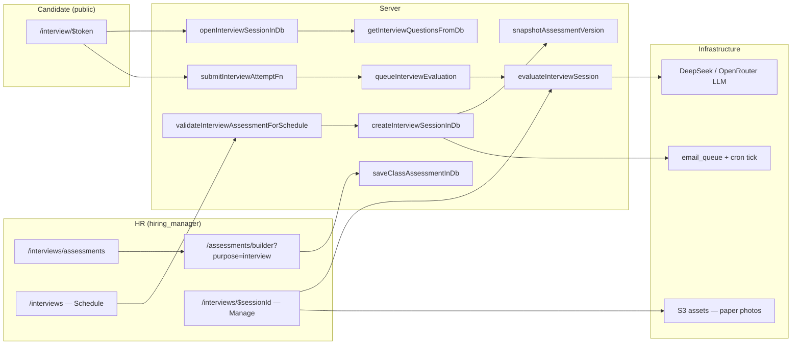

# Assessment System Audit Report — HR Rollout

**Date:** 2026-06-30  
**Scope:** Interview/hiring assessment flow (not employee training assignments)

---

## 1. Connection map

**Lifecycle:** `draft` → `validated`/`published` test → schedule (version snapshot) → `scheduled` → identity confirm → `waiting` → HR opens → `opened` → start → `in_progress` → submit → `submitted` → `evaluating` → `evaluated`.

---

## 2. Bug list

| Sev | Issue | Status | Files |
|-----|-------|--------|-------|
| **P0** | Submission review showed **live** questions after HR edited a test post-schedule | **Fixed** | `interview.server.ts` — `getInterviewSubmissionRecordFromDb`, `getPublicInterviewState`, `getInterviewSessionByIdFromDb` |
| **P0** | Synchronous AI eval on submit risked HTTP timeout | **Fixed** | `interview-eval-queue.server.ts`, `interview.functions.ts` — background `queueInterviewEvaluation` |
| **P1** | Session list loaded all rows (no pagination) | **Fixed** | `interview.server.ts`, `interviews.index.tsx` — 100/page + total count |
| **P1** | Bulk import silently mapped duplicate test titles to wrong assessment | **Fixed** | `interview-bulk-import.server.ts` — reject import if titles collide |
| **P1** | MCQ grading failed when `correct_answer` was letter (`A`) but UI submitted full option text | **Fixed** | `mcq-match.server.ts` — used in submit, AI eval, trainee attempts |
| **P1** | Interview tests could be assigned to trainees via `/assignments` | **Fixed** | `assignments.server.ts` — `purpose === 'interview'` blocked |
| **P2** | In-memory AI rate limit not global across serverless instances | Open | `ai-rate-limit.server.ts` |
| **P2** | Each interview creates orphan `candidates` row | Open | `interview.server.ts` `createInterviewSessionInDb` |
| **P2** | Bulk import 200 rows sequential — may timeout on slow hosts | Mitigated | Max 200 rows; consider batch job later |
| **P2** | Route guards client-only (`AdminLayout`) | Acceptable | Server middleware is authoritative |

---

## 3. Fixes applied (this audit)

1. **Version-aware submission & public state** — HR review and candidate waiting room use snapshotted `assessment_version_id` when present.
2. **Background evaluation** — Submit returns immediately; `queueInterviewEvaluation` runs AI grading async. HR page polls `submitted`/`evaluating` and offers **Run evaluation** if stuck.
3. **Paginated interview list** — Default 100 sessions per page with Previous/Next.
4. **Duplicate title guard** on bulk import.
5. **Shared MCQ matcher** — letter ↔ option text normalization.
6. **Training assignment guard** — interview-purpose assessments cannot be assigned to trainees.

---

## 4. HR runbook addendum — what breaks without infra

| Missing / broken | Symptom | Fix |
|------------------|---------|-----|
| **Email cron** (`POST /api/internal/cron/tick` every ~5 min) | Candidate invite shows “queued” but never arrives | Enable cron; check `/notifications` queue |
| **`APP_BASE_URL`** wrong or localhost in prod | Magic links point to wrong host | Set HTTPS production URL in env |
| **`DEEPSEEK_API_KEY` / `OPENROUTER_API_KEY`** | Submit succeeds; status stays `submitted`; no hire recommendation | HR clicks **Run evaluation** on session; fix API keys |
| **`S3_ASSETS_BUCKET`** (prod) | Paper photo upload/grade fails | Configure S3 per `scripts/configure-s3-assets.md` |
| **`interview_invite` email template** missing | Schedule succeeds; `emailError` in UI | Run `npm run db:apply-email-seeds` |
| **Enterprise DB scripts not applied** | Scheduling fails (no `assessment_versions`) | Run `db:apply-interview`, `db:apply-enterprise`, `db:apply-paper-only` |
| **Duplicate interview test titles** | Bulk import rejected with explicit error | Rename tests in Interview tests |
| **HR user without `hiring_manager` role** | “No Access” after sign-in | Admin sends invite from `/invites` |

---

## 5. Load notes

| Scale | Expected behavior | Risk |
|-------|-------------------|------|
| **~50 concurrent live sessions** | Fine — 5s candidate poll + 30s HR list poll per open tab | Low |
| **~500 sessions total** | Paginated list (100/page) keeps queries bounded | Low |
| **~500 concurrent live sessions** | DB poll load grows (~100 req/s from candidates alone) | Medium — add status filters, reduce poll interval when idle |
| **~2000 concurrent** | Neon connection + serverless concurrency pressure; AI eval queue backs up | High — move eval to job queue; WebSocket or SSE for proctoring |

**Bulk import:** Up to 200 candidates per request; each row = 1 DB transaction + optional email enqueue. Large imports may need splitting across multiple uploads.

---

## 6. Verification checklist

| # | Scenario | Automated | Notes |
|---|----------|-----------|-------|
| 1 | Create + validate interview test | Manual | `purpose: interview` in builder |
| 2 | Schedule online | Manual | Email queued; magic link uses `APP_BASE_URL` |
| 3 | Wrong identity | Manual | `confirmInterviewIdentityFn` rejects |
| 4 | Open before waiting room | Manual | `openInterviewSessionInDb` error |
| 5 | Full submit → evaluated | Manual | Background eval; poll HR session page |
| 6 | Edit test after schedule | **Code fix** | Submission uses snapshot |
| 7 | Paper-only | Manual | No email; S3 upload required in prod |
| 8 | Bulk import | Manual | Duplicate titles blocked |
| 9 | Resend invite | Manual | Token regenerated |
| 10 | CEO read-only | Manual | `requireContentManager` blocks writes |
| 11 | Expired token | Manual | `interview-token.server.ts` |
| 12 | Double submit | Manual | `alreadySubmitted: true` |
| 13 | AI down on submit | Manual | Status `submitted`; rerun evaluation |
| 14 | Cron tick | Ops | SES delivery |

**Schema audit:** `node scripts/audit-schema.mjs` — **PASSED** (74 checks).  
**Unit tests:** `mcq-match.test.ts`, `answer-keys.test.ts` — **PASSED**.  
**Deploy validation:** `npm run validate:deploy -- --production` — fails locally if `APP_BASE_URL` is localhost (expected in dev).

---

## 7. Training flow cross-contamination

- `/assessments` index filters out `purpose === 'interview'` from assignment UI.
- `assignAssessmentInDb` now rejects `purpose === 'interview'`.
- Interview scheduling requires `purpose === 'interview'` via `validateInterviewAssessmentForSchedule`.

Employee training and HR interview flows remain separate by design (`docs/HR_ROLLOUT.md`).
