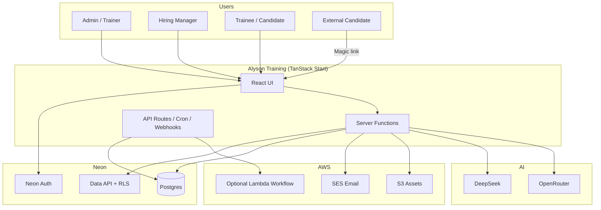
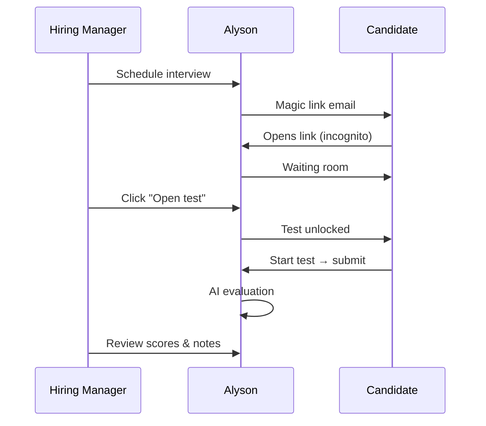

# Alyson Training Platform — Implementation & Usage Guide

**Version:** 1.0.0  
**Last updated:** July 2026  
**Audience:** IT implementers, administrators, trainers, HR, hiring managers, and learners

---

## Document purpose

This guide is the single reference for **deploying**, **configuring**, and **operating** the Alyson Training platform end to end. It is written so that a novice implementer can follow each section in order without prior knowledge of the stack.

Use the screenshot placeholders throughout this document. Save captures under `docs/images/screenshots/` using the suggested filenames so they can be embedded later.

**Related technical docs** (deeper dives on specific topics):

| Topic | Document |
|-------|----------|
| Neon database & auth | [NEON_SETUP.md](./NEON_SETUP.md) |
| Vercel deployment | [VERCEL_DEPLOY.md](./VERCEL_DEPLOY.md) |
| General deployment | [DEPLOYMENT.md](./DEPLOYMENT.md) |
| AWS email (SES) | [AWS_SES_SETUP.md](./AWS_SES_SETUP.md) |
| S3 asset storage | [../scripts/configure-s3-assets.md](../scripts/configure-s3-assets.md) |
| HR rollout (short) | [HR_ROLLOUT.md](./HR_ROLLOUT.md) |
| Syllabus bulk import | [SYLLABUS_IMPORT.md](./SYLLABUS_IMPORT.md) |

---

## Table of contents

1. [Platform overview](#1-platform-overview)
2. [Architecture at a glance](#2-architecture-at-a-glance)
3. [Roles and access matrix](#3-roles-and-access-matrix)
4. [Prerequisites checklist](#4-prerequisites-checklist)
5. [Part I — Technical implementation](#part-i--technical-implementation)
6. [Part II — Administrator guide](#part-ii--administrator-guide)
7. [Part III — Trainer & content manager guide](#part-iii--trainer--content-manager-guide)
8. [Part IV — HR & hiring manager guide](#part-iv--hr--hiring-manager-guide)
9. [Part V — Trainee & learner guide](#part-v--trainee--learner-guide)
10. [Part VI — Executive (CEO) guide](#part-vi--executive-ceo-guide)
11. [Operations & maintenance](#11-operations--maintenance)
12. [Troubleshooting reference](#12-troubleshooting-reference)
13. [Appendix A — Screenshot index](#appendix-a--screenshot-index)
14. [Appendix B — Environment variables](#appendix-b--environment-variables)
15. [Appendix C — npm scripts reference](#appendix-c--npm-scripts-reference)

---

## 1. Platform overview

**Alyson Training** is Cintara’s internal learning and hiring assessment platform. It unifies two major workflows in one application:

| Workflow | Primary users | What it does |
|----------|---------------|--------------|
| **Employee training** | Trainers, trainees | Courses, classes, study materials, assessments, assignments, analytics |
| **Candidate hiring** | Hiring managers, CEO | Interview tests, candidate scheduling, proctoring, AI evaluation, hiring reports |

### Key capabilities

- **AI-assisted content creation** — generate class sections, questions, and interview tests from uploaded PDFs and transcripts
- **Role-based workspaces** — each user sees only the navigation and routes appropriate to their role
- **Secure authentication** — Google Workspace SSO and email/password via Neon Auth; domain-locked to `@cintara.ai`
- **Transactional email** — invites, interview magic links, assignment notifications via AWS SES
- **Asset storage** — class PDFs, videos, and interview paper photos stored in AWS S3 (production) or local disk (development)
- **Proctored interviews** — hiring managers unlock tests during live video calls; candidates use magic links (no account required)

### Technology stack

| Layer | Technology |
|-------|------------|
| Frontend & SSR | TanStack Start (React 19 + Nitro) |
| Database | Neon Postgres |
| Authentication | Neon Auth (JWT, Google OAuth) |
| User-scoped data access | Neon Data API (RLS enforced) |
| System / admin SQL | Direct `pg` pool (`DATABASE_URL`) |
| Email | AWS SES + Postgres email queue |
| AI | DeepSeek (primary) → OpenRouter (fallback) |
| File storage | AWS S3, Vercel Blob, or local disk |
| Hosting (recommended) | Vercel |

> **Screenshot placeholder**  
> Save as: `docs/images/screenshots/00-platform-dashboard.png`  
> *Capture the admin dashboard (`/`) after first login — shows the main navigation sidebar and overview cards.*

---

## 2. Architecture at a glance

Understanding how the pieces connect helps when debugging auth, email, or upload issues.



### Dual database access pattern

Every server operation uses **one** of two Postgres paths — never both for the same concern:

| Access path | Client | When to use |
|-------------|--------|-------------|
| **Neon Data API** (`db`) | `integrations/neon/client.ts` | User-scoped reads/writes; RLS enforced |
| **Direct `pg` pool** | `lib/pg.server.ts` | Admin SQL, cron, bootstrap, interviews — bypasses RLS |

> **Screenshot placeholder**  
> Save as: `docs/images/screenshots/01-architecture-diagram.png`  
> *Optional: export the Mermaid diagram above as a PNG for slide decks.*

---

## 3. Roles and access matrix

Roles are stored in Postgres (`user_roles`) and assigned via **invites** or bootstrap rules. Access is enforced in the UI via `AdminLayout` and `role-access.ts`.

| Role | Label in UI | Home after sign-in | Primary routes |
|------|-------------|-------------------|----------------|
| `admin` | Admin | `/` (dashboard) | Full platform including Invites, Users, Settings, Email Testing |
| `trainer` | Creator | `/` | Courses, classes, assessments, assignments, interviews (no admin-only pages) |
| `trainee` | Student | `/learn/dashboard` | Learner portal only |
| `candidate` | Candidate | `/learn/dashboard` | Subset of learner routes (trial onboarding) |
| `hiring_manager` | Hiring Manager | `/interviews` | Interviews, interview tests, hiring pipeline, reports |
| `ceo` | CEO | `/hiring/reports` | Read-only executive views: dashboard, analytics, hiring, interviews |

### Navigation by role

| Sidebar item | Admin | Trainer | Hiring Mgr | CEO | Trainee |
|--------------|:-----:|:-------:|:----------:|:---:|:-------:|
| Dashboard | ✓ | ✓ | — | ✓ | — |
| Create Class | ✓ | ✓ | — | — | — |
| Courses | ✓ | ✓ | — | — | — |
| Users | ✓ | — | — | — | — |
| Invites | ✓ | — | — | — | — |
| Assessments | ✓ | ✓ | — | — | — |
| Assignments | ✓ | ✓ | — | — | — |
| Interviews | ✓ | ✓ | ✓ | ✓ | — |
| Interview Tests | ✓ | ✓ | ✓ | — | — |
| Hiring Pipeline | ✓ | ✓ | ✓ | — | — |
| Hiring Reports | ✓ | ✓ | ✓ | ✓ | — |
| Analytics / Executive | ✓ | ✓ | ✓ | ✓ | — |
| Notifications / Settings | ✓ | — | — | — | — |
| Learn portal (`/learn`) | — | — | — | — | ✓ |

### Sign-in rules

- Only **`@cintara.ai`** email addresses are accepted.
- New users without a role see the **No Access** panel until an admin sends an invite.
- The **first user** in a fresh database automatically receives `admin` + `trainer` (or use `BOOTSTRAP_ADMIN_EMAILS`).

> **Screenshot placeholder**  
> Save as: `docs/images/screenshots/02-role-no-access-panel.png`  
> *Capture the “No Access” screen shown when a user signs in without an assigned role.*

> **Screenshot placeholder**  
> Save as: `docs/images/screenshots/03-hiring-manager-sidebar.png`  
> *Capture the reduced sidebar visible to a Hiring Manager-only account.*

---

## 4. Prerequisites checklist

Complete this checklist **before** starting implementation.

### Accounts & services

- [ ] **Git** access to the Alyson Training repository
- [ ] **Node.js 20+** installed locally
- [ ] **Neon** account — project with Postgres, Auth, and Data API enabled
- [ ] **AWS** account — SES verified domain, IAM user, S3 bucket (production)
- [ ] **DeepSeek** and/or **OpenRouter** API key for AI features
- [ ] **Vercel** account (recommended host) or Docker-capable server
- [ ] **Google Cloud** OAuth client (optional; Neon provides shared dev credentials)
- [ ] **DNS** access for `cintara.ai` (SPF, DKIM, DMARC for SES)
- [ ] **Cron scheduler** — cron-job.org (Vercel Hobby) or Vercel Cron (Pro)

### Local development tools

```bash
node --version    # must be >= 20
npm --version
git --version
```

### Knowledge assumptions

This guide assumes you can:

- Copy environment variables into a `.env` file
- Run terminal commands in the project root
- Navigate a web browser to `http://localhost:5173`
- Add DNS records and environment variables in cloud consoles

---

## Part I — Technical implementation

Follow these steps **in order** for a first-time setup.

### Step 1 — Clone and install

```bash
git clone <repository-url>
cd Alyson-Training-Project
npm install
```

> **Screenshot placeholder**  
> Save as: `docs/images/screenshots/10-terminal-npm-install.png`  
> *Terminal showing successful `npm install` completion.*

---

### Step 2 — Configure environment variables

```bash
cp .env.example .env
```

Open `.env` and fill in every required value. See [Appendix B](#appendix-b--environment-variables) for the full list.

**Minimum for local development:**

| Variable | Where to get it |
|----------|-----------------|
| `VITE_NEON_AUTH_URL` | Neon Console → Branch → Auth |
| `VITE_NEON_DATA_API_URL` | Neon Console → Branch → Data API |
| `DATABASE_URL` | Neon Console → Connection string |
| `APP_BASE_URL` | `http://localhost:5173` |
| `CRON_SECRET` | Generate a long random string |
| `BOOTSTRAP_ADMIN_EMAILS` | Your `@cintara.ai` email |
| `DEEPSEEK_API_KEY` or `OPENROUTER_API_KEY` | Provider dashboard |
| `AWS_ACCESS_KEY_ID` / `AWS_SECRET_ACCESS_KEY` | IAM user |
| `AWS_REGION` / `SES_REGION` | `us-west-2` (match SES identity region) |

Verify auth configuration:

```bash
npm run auth:verify-env
```

> **Screenshot placeholder**  
> Save as: `docs/images/screenshots/11-neon-auth-urls.png`  
> *Neon Console showing Auth URL and Data API URL copied into your notes.*

> **Screenshot placeholder**  
> Save as: `docs/images/screenshots/12-env-file-redacted.png`  
> *Your `.env` file with secrets redacted — show structure only, not real keys.*

---

### Step 3 — Apply database schema

Schema is **not auto-migrated**. Run once per Neon project:

```bash
npm run db:apply-all
```

This applies, in order: core schema, interview tables, enterprise/hiring schema, onboarding seeds, RLS policies, email templates, and performance indexes.

Verify completeness:

```bash
node scripts/audit-schema.mjs
```

> **Screenshot placeholder**  
> Save as: `docs/images/screenshots/13-db-apply-all-success.png`  
> *Terminal showing `✓ All database scripts applied successfully`.*

---

### Step 4 — Configure Neon Auth

In **Neon Console → Branch → Auth**:

#### Trusted domains

| Environment | Origin to add |
|-------------|---------------|
| Local | `http://localhost:5173` |
| Production | `https://your-domain.com` |

Enable **Allow localhost** for development.

#### Email & password

Enable sign-in and sign-up.

#### Google OAuth

1. Enable Google in Neon Auth.
2. If using your own Google Cloud client, set redirect URI:
   ```
   https://<your-neon-auth-host>/callback/google
   ```
3. Add JavaScript origins: `http://localhost:5173` and your production domain.

> **Screenshot placeholder**  
> Save as: `docs/images/screenshots/14-neon-trusted-domains.png`  
> *Neon Auth settings with localhost and production domain in trusted domains.*

> **Screenshot placeholder**  
> Save as: `docs/images/screenshots/15-google-oauth-origins.png`  
> *Google Cloud Console OAuth client showing authorized origins and redirect URI.*

---

### Step 5 — Configure AWS SES (email)

All platform email is sent from **`training.group@cintara.ai`** (hardcoded sender).

1. Open [Amazon SES](https://console.aws.amazon.com/ses/) in **us-west-2**.
2. Verify domain `cintara.ai` with DKIM CNAME records.
3. Add SPF and DMARC DNS records (see [AWS_SES_SETUP.md](./AWS_SES_SETUP.md)).
4. Create configuration set `alyson-training` with SNS → webhook `https://<APP_BASE_URL>/api/webhooks/ses`.
5. Request **production access** (required to email unverified recipients).
6. Create IAM user with `ses:SendEmail` permission.

Verify locally:

```bash
npm run email:verify-aws
```

> **Screenshot placeholder**  
> Save as: `docs/images/screenshots/16-ses-verified-domain.png`  
> *SES console showing `cintara.ai` as a verified identity.*

---

### Step 6 — Configure S3 asset storage (recommended)

For production and local dev with persistent uploads:

1. Create bucket `alyson-training-media` in `us-west-2`.
2. Block all public access (learners receive presigned URLs).
3. Attach IAM policy for `s3:PutObject`, `s3:GetObject`, `s3:DeleteObject`, `s3:ListBucket`.
4. Set in `.env`:

```env
ASSET_STORAGE_BACKEND=s3
S3_ASSETS_BUCKET=alyson-training-media
S3_ASSETS_REGION=us-west-2
```

Test:

```bash
npm run assets:test-s3
```

See [configure-s3-assets.md](../scripts/configure-s3-assets.md) for lifecycle and migration steps.

> **Screenshot placeholder**  
> Save as: `docs/images/screenshots/17-s3-bucket-settings.png`  
> *S3 bucket with public access blocked and region us-west-2.*

---

### Step 7 — Start local development server

```bash
npm run dev
```

Open **http://localhost:5173/auth**

For immediate email delivery in dev (optional):

```env
EMAIL_AUTO_PROCESS=1
```

> **Never set `EMAIL_AUTO_PROCESS=1` in production** — use cron instead.

> **Screenshot placeholder**  
> Save as: `docs/images/screenshots/18-auth-sign-in-page.png`  
> *The `/auth` sign-in page with Google and email/password options.*

---

### Step 8 — First admin sign-in

1. Sign in with a `@cintara.ai` account listed in `BOOTSTRAP_ADMIN_EMAILS` (or be the first user in the database).
2. The app bootstraps your `profiles` row and assigns roles.
3. You should land on the **Dashboard** (`/`).

If stuck on “Setting up your workspace…”, check `DATABASE_URL` and Vercel/Neon function logs.

Grant admin manually (alternative):

```bash
npm run auth:grant-admin -- your.name@cintara.ai
```

> **Screenshot placeholder**  
> Save as: `docs/images/screenshots/19-first-admin-dashboard.png`  
> *Dashboard immediately after first successful admin bootstrap.*

---

### Step 9 — Production deployment (Vercel)

Detailed steps: [VERCEL_DEPLOY.md](./VERCEL_DEPLOY.md). Summary:

1. Push repo to GitHub.
2. Import project on [vercel.com/new](https://vercel.com/new).
3. Add **all** environment variables from `.env.example` (Production).
4. Set `APP_BASE_URL` to your Vercel or custom domain (no trailing slash).
5. Set `NODE_ENV=production`.
6. Add production URL to Neon trusted domains + Google OAuth.
7. Deploy and verify:

```bash
curl https://your-app.vercel.app/api/health
# → {"ok":true,"service":"alyson-training",...}
```

8. Configure email cron (every 5 minutes):

```
GET or POST https://<APP_BASE_URL>/api/internal/cron/tick
Authorization: Bearer <CRON_SECRET>
```

On Vercel **Hobby**, use [cron-job.org](https://cron-job.org) — native Vercel Cron is limited to once per day.

9. Remove or clear `BOOTSTRAP_ADMIN_EMAILS` after the first admin has signed in.

> **Screenshot placeholder**  
> Save as: `docs/images/screenshots/20-vercel-env-vars.png`  
> *Vercel Project Settings → Environment Variables (values redacted).*

> **Screenshot placeholder**  
> Save as: `docs/images/screenshots/21-health-check-ok.png`  
> *Browser or terminal showing `/api/health` returning `"ok": true`.*

> **Screenshot placeholder**  
> Save as: `docs/images/screenshots/22-cron-job-config.png`  
> *cron-job.org (or Vercel Cron) configured with URL and Authorization header.*

---

### Step 10 — Post-deploy validation

Run the production validation script:

```bash
NODE_ENV=production npm run validate:deploy -- --production
```

Smoke-test these flows:

| # | Flow | Pass criteria |
|---|------|---------------|
| 1 | Admin sign-in | Lands on dashboard |
| 2 | Send invite | Email appears in Notifications queue; cron drains it |
| 3 | Create class + upload PDF | File persists (S3 or storage) |
| 4 | Schedule interview | Candidate receives magic link email |
| 5 | Learner sign-in | Trainee lands on `/learn/dashboard` |

---

## Part II — Administrator guide

Administrators manage users, system configuration, email, and platform health.

### 2.1 Inviting users

**Route:** `/invites`

1. Click **Create invite**.
2. Enter the user’s `@cintara.ai` email.
3. Select a role:
   - **Admin** — full access
   - **Creator (trainer)** — content and assignments
   - **Hiring Manager** — interviews only
   - **CEO** — executive read-only views
   - **Student (trainee)** — learner portal
4. The invitee receives an email with a sign-up link. You can also copy the link from the invites table.

> **Screenshot placeholder**  
> Save as: `docs/images/screenshots/30-invites-create-dialog.png`  
> *Create invite dialog with email and role selector.*

> **Screenshot placeholder**  
> Save as: `docs/images/screenshots/31-invites-table.png`  
> *Invites table showing pending and accepted invites with copy-link action.*

---

### 2.2 Managing users

**Route:** `/users`

- View all workspace members and their roles.
- Open a user’s learner profile for progress inspection.
- Adjust roles (admin only).

> **Screenshot placeholder**  
> Save as: `docs/images/screenshots/32-users-list.png`  
> *Users page with role badges and search.*

---

### 2.3 Email & notifications

**Routes:** `/notifications`, `/notifications/templates`, `/email-testing`

| Page | Purpose |
|------|---------|
| Notifications | Email queue status, send log, failed messages |
| Email Templates | Edit transactional template content |
| Email Testing | Send a test email to verify SES integration |

**How email works:** The app never calls SES directly from UI actions. It enqueues via the `enqueue_email` Postgres RPC. Cron at `/api/internal/cron/tick` drains the queue.

> **Screenshot placeholder**  
> Save as: `docs/images/screenshots/33-notifications-queue.png`  
> *Notifications page showing queued and sent emails.*

---

### 2.4 System settings

**Route:** `/settings`

Configure workspace policies, onboarding PDFs, and platform preferences.

> **Screenshot placeholder**  
> Save as: `docs/images/screenshots/34-settings-page.png`  
> *Settings page overview.*

---

### 2.5 Admin production checklist

Before handing the platform to HR or trainers:

- [ ] Production URL uses HTTPS
- [ ] Neon trusted domains include production URL
- [ ] Google OAuth origins include production URL
- [ ] `APP_BASE_URL` matches the live domain
- [ ] Email cron runs every 5 minutes
- [ ] SES production access approved
- [ ] S3 bucket configured (`S3_ASSETS_BUCKET`)
- [ ] `BOOTSTRAP_ADMIN_EMAILS` cleared after bootstrap
- [ ] At least one admin and one hiring manager invited
- [ ] `/api/health` returns OK

---

## Part III — Trainer & content manager guide

Trainers (Creators) build courses, publish classes, create assessments, and assign training to employees.

### 3.1 Creating a class

**Route:** `/classes/new`

1. Enter class title, summary, and difficulty level.
2. Add **sections** — each section can include:
   - Title and description
   - PDF documents (uploaded to S3 or local storage)
   - Video links
   - Transcripts (for AI question generation)
3. Use **AI assist** to generate section content from uploaded materials.
4. Save as **draft** or **published**.

> **Screenshot placeholder**  
> Save as: `docs/images/screenshots/40-create-class-wizard.png`  
> *Class creation form with sections panel.*

> **Screenshot placeholder**  
> Save as: `docs/images/screenshots/41-class-pdf-upload.png`  
> *PDF upload in a section with extraction status.*

---

### 3.2 Organizing courses

**Route:** `/courses`

1. Create a course (e.g. “Data Science Foundations”).
2. Add existing published classes to the course.
3. Optionally mark as **Core onboarding course**.
4. Link **departments** for role-specific auto-enrollment.

**Bulk import:** On a course page, use **Bulk import** to load classes and sections from Excel. See [SYLLABUS_IMPORT.md](./SYLLABUS_IMPORT.md).

> **Screenshot placeholder**  
> Save as: `docs/images/screenshots/42-courses-list.png`  
> *Courses list with status and enrollment counts.*

> **Screenshot placeholder**  
> Save as: `docs/images/screenshots/43-course-detail-bulk-import.png`  
> *Course detail page with Bulk import button and department panel.*

---

### 3.3 Building assessments

**Routes:** `/assessments`, `/assessments/builder`, `/assessments/templates`

1. Open the assessment builder for a class.
2. Generate MCQ / short-answer questions with AI (uses extracted PDF text).
3. Set pass mark, time limit, and retake rules.
4. **Validate** the assessment, then **publish**.

Test templates (`/assessments/templates`) provide reusable question patterns.

> **Screenshot placeholder**  
> Save as: `docs/images/screenshots/44-assessment-builder.png`  
> *Assessment builder with AI-generated questions and validate button.*

---

### 3.4 Assigning training

**Route:** `/assignments`

1. Select a course or class.
2. Choose trainees (individuals or groups).
3. Set due date and notification preferences.
4. Assignment emails are queued and sent via cron / optional Step Functions workflow.

Learners see assignments at `/learn/assignments` and take tests at `/attempt/$assignmentId`.

> **Screenshot placeholder**  
> Save as: `docs/images/screenshots/45-assignments-create.png`  
> *New assignment dialog with course and trainee selection.*

---

### 3.5 Monitoring progress

**Routes:** `/analytics`, `/users/$userId/learner`

- **Analytics** — completion rates, assessment scores, cohort trends.
- **User learner profile** — per-trainee progress through courses and sections.

> **Screenshot placeholder**  
> Save as: `docs/images/screenshots/46-analytics-dashboard.png`  
> *Analytics page with charts and filters.*

---

### 3.6 Creator / student mode toggle

On the Learn layout, staff with trainer access can switch between **Creator** and **Student** view using the toggle (persisted in `localStorage` as `alyson-view-mode`). Use Student mode to preview the learner experience.

> **Screenshot placeholder**  
> Save as: `docs/images/screenshots/47-learn-mode-toggle.png`  
> *Learn layout header showing Creator / Student toggle.*

---

## Part IV — HR & hiring manager guide

Interview workflows are **separate** from employee training. Interview tests are never auto-assigned to staff.

### 4.1 Getting access

1. Admin creates an invite at `/invites` with role **Hiring Manager**.
2. Sign up with the same `@cintara.ai` email.
3. You land on **Interviews** (`/interviews`).

> **Screenshot placeholder**  
> Save as: `docs/images/screenshots/50-interviews-home.png`  
> *Interviews page with session list and Schedule interview button.*

---

### 4.2 Creating interview tests

**Route:** `/interviews/assessments`

1. Click **Create interview test**.
2. Define job context and skills to assess.
3. Generate questions with AI; review in the builder.
4. **Validate**, then **Save**.
5. Test must be **validated** or **published** before scheduling candidates.

> **Screenshot placeholder**  
> Save as: `docs/images/screenshots/51-interview-test-builder.png`  
> *Interview test builder with question list and validate action.*

---

### 4.3 Scheduling candidates

#### Single candidate

**Route:** `/interviews` → **Schedule interview**

| Field | Notes |
|-------|-------|
| Candidate name | Display name |
| Candidate email | Any domain — external candidates supported |
| Job title | e.g. “Data Analyst” |
| Interview test | Must be validated/published |
| Mode | Online · Paper only · Hybrid |

Modes:

| Mode | Behavior |
|------|----------|
| **Online** | Magic link emailed to candidate |
| **Paper only** | In-person test; upload photos later |
| **Hybrid** | Online with paper component |

> **Screenshot placeholder**  
> Save as: `docs/images/screenshots/52-schedule-interview-dialog.png`  
> *Schedule interview form with mode selector.*

#### Bulk upload

1. Click **Bulk upload** on `/interviews`.
2. Download the Excel template.
3. Fill the `Candidates` sheet: `candidate_name`, `candidate_email`, `job_title`.
4. Upload and review per-row success/failure summary.

> **Screenshot placeholder**  
> Save as: `docs/images/screenshots/53-bulk-upload-template.png`  
> *Bulk upload dialog with template download and import results.*

---

### 4.4 Interview day — proctoring



**Steps:**

1. Candidate opens magic link in **incognito / separate browser**.
2. Candidate waits in the **waiting room**.
3. When you are on the video call, click **Open test** on their session row.
4. Candidate presses **Start test**.
5. Use **Manage** for status, proctor notes, resend link, or paper photo uploads.

**Status reference:**

| Status | Meaning |
|--------|---------|
| `scheduled` | Invite sent |
| `waiting` | Candidate in waiting room |
| `opened` | You unlocked the test |
| `in progress` | Candidate taking test |
| `evaluated` | AI review ready |

> **Screenshot placeholder**  
> Save as: `docs/images/screenshots/54-interview-waiting-room.png`  
> *Candidate waiting room (magic link page).*

> **Screenshot placeholder**  
> Save as: `docs/images/screenshots/55-proctor-open-test.png`  
> *Hiring manager session row with Open test and Manage actions.*

> **Screenshot placeholder**  
> Save as: `docs/images/screenshots/56-interview-results.png`  
> *Session manage page with scores, hire recommendation, and proctor notes.*

---

### 4.5 Hiring pipeline & reports

| Route | Purpose |
|-------|---------|
| `/hiring/pipeline` | Track candidates through hiring stages |
| `/hiring/reports` | Aggregate outcomes for leadership |

> **Screenshot placeholder**  
> Save as: `docs/images/screenshots/57-hiring-reports.png`  
> *Hiring reports page with candidate outcomes table.*

---

## Part V — Trainee & learner guide

Trainees access the platform at **`/learn`**.

### 5.1 Getting started

1. Accept your invite (role: **Student**).
2. Sign in at `/auth`.
3. You land on **Learn Dashboard** (`/learn/dashboard`).

> **Screenshot placeholder**  
> Save as: `docs/images/screenshots/60-learn-dashboard.png`  
> *Learner dashboard with enrolled courses and progress.*

---

### 5.2 Studying course material

**Routes:** `/learn/courses`, `/learn/courses/$courseId/study`, `/learn/guide/$courseId/$sectionId`

1. Open **My Courses**.
2. Select a course → browse classes and sections.
3. Read materials, watch videos, download PDFs.
4. Mark sections complete as you progress.

> **Screenshot placeholder**  
> Save as: `docs/images/screenshots/61-learn-study-view.png`  
> *Section study view with PDF viewer and navigation.*

---

### 5.3 Taking assessments

**Routes:** `/learn/assignments`, `/attempt/$assignmentId`

1. Open **Assignments** from the learn navigation.
2. Click an assignment to start the timed test.
3. Submit when finished — results appear after grading (instant for MCQ; AI for open-ended).

> **Screenshot placeholder**  
> Save as: `docs/images/screenshots/62-learn-assignment-attempt.png`  
> *Assessment attempt page with timer and questions.*

---

### 5.4 Policies & onboarding

**Routes:** `/learn/policies`, `/learn/trial`, `/learn/guide`

New hires may see onboarding paths, policy acknowledgements, and trial assignments depending on role (`candidate` vs `trainee`).

> **Screenshot placeholder**  
> Save as: `docs/images/screenshots/63-learn-policies.png`  
> *Policies page with PDF acknowledgements.*

---

## Part VI — Executive (CEO) guide

CEO users have **read-only** access to high-level dashboards.

### 6.1 Landing & navigation

- Home: **`/hiring/reports`**
- Available: Dashboard, Analytics, Interviews (view), Hiring Reports, Executive

### 6.2 Executive dashboard

**Route:** `/executive`

Consolidated view of training completion, hiring funnel, and AI usage costs.

> **Screenshot placeholder**  
> Save as: `docs/images/screenshots/70-executive-dashboard.png`  
> *Executive page with training, hiring, and AI cost summary cards.*

---

## 11. Operations & maintenance

### 11.1 Health monitoring

```bash
curl https://<APP_BASE_URL>/api/health
```

Returns database connectivity, Neon JWKS, storage backend, and SES/AI configuration status.

Optional: set `SENTRY_DSN` for error tracking.

### 11.2 Email queue operations

| Action | Command / endpoint |
|--------|-------------------|
| Manual drain (local) | `npm run email:process` |
| Cron tick (local) | `npm run email:cron` |
| Production cron | `POST /api/internal/cron/tick` with `Authorization: Bearer <CRON_SECRET>` |

### 11.3 Database updates

When pulling new code that includes SQL in `db/`:

1. Review which new scripts were added.
2. Run them in documented order (see `scripts/db-apply-all.mjs`).
3. Record applied scripts in your runbook (Neon branch + date).

### 11.4 Asset migration to S3

```bash
npm run assets:migrate-s3 -- --from=local-disk --dry-run
npm run assets:migrate-s3 -- --from=local-disk
```

### 11.5 Security practices

- Rotate `CRON_SECRET` and API keys if `.env` was ever exposed.
- Clear `BOOTSTRAP_ADMIN_EMAILS` after initial admin setup.
- Asset URLs are HMAC-signed in production.
- Never commit `.env` to git.

### 11.6 Release workflow

1. Apply new SQL migrations.
2. Bump version in `package.json`.
3. Run `npm run validate:deploy -- --production`.
4. Build and deploy.
5. Smoke-test auth, email, and one interview flow.

---

## 12. Troubleshooting reference

### Authentication

| Symptom | Likely cause | Fix |
|---------|--------------|-----|
| Google button does nothing | Missing trusted domain | Add origin to Neon Auth trusted domains |
| `redirect_uri_mismatch` | Wrong Google redirect URI | Set `<auth-url>/callback/google` |
| “Access denied” after Google | Non-`@cintara.ai` account | Use company Google Workspace email |
| “No Access” after sign-in | No role assigned | Admin sends invite from `/invites` |
| Stuck on “Setting up workspace…” | `DATABASE_URL` missing/invalid | Check env vars and Neon connection |
| Sign-in works locally, not on Vercel | `VITE_*` not set at build | Add vars in Vercel; redeploy |

### Email

| Symptom | Likely cause | Fix |
|---------|--------------|-----|
| Invite email not received | Cron not running | Set up 5-minute cron with `CRON_SECRET` |
| Email stuck in queue | SES sandbox / wrong region | Request production access; match `SES_REGION` |
| Wrong links in email | `APP_BASE_URL` mismatch | Set to production domain; redeploy |

### Content & uploads

| Symptom | Likely cause | Fix |
|---------|--------------|-----|
| PDF upload disappears on Vercel | Ephemeral filesystem | Configure S3 (`S3_ASSETS_BUCKET`) |
| “Could not save class” Unauthorized | Auth / CSRF mismatch | Set `NEON_AUTH_URL` at runtime; redeploy |
| AI generation fails | Missing API key | Set `DEEPSEEK_API_KEY` or `OPENROUTER_API_KEY` |

### Interviews

| Symptom | Likely cause | Fix |
|---------|--------------|-----|
| Cannot schedule | Test not validated | Validate/publish interview test |
| Candidate stuck in waiting room | Proctor hasn’t opened test | Click **Open test** on session row |
| Paper photos not saving | No persistent storage | Use S3 backend |

---

## Appendix A — Screenshot index

Create folder: `docs/images/screenshots/`

| # | Filename | Section | What to capture |
|---|----------|---------|-----------------|
| 00 | `00-platform-dashboard.png` | Overview | Admin dashboard |
| 01 | `01-architecture-diagram.png` | Architecture | Exported architecture diagram |
| 02 | `02-role-no-access-panel.png` | Roles | No Access screen |
| 03 | `03-hiring-manager-sidebar.png` | Roles | Hiring manager navigation |
| 10 | `10-terminal-npm-install.png` | Setup | npm install success |
| 11 | `11-neon-auth-urls.png` | Setup | Neon Console URLs |
| 12 | `12-env-file-redacted.png` | Setup | .env structure (redacted) |
| 13 | `13-db-apply-all-success.png` | Setup | db:apply-all output |
| 14 | `14-neon-trusted-domains.png` | Setup | Neon trusted domains |
| 15 | `15-google-oauth-origins.png` | Setup | Google OAuth config |
| 16 | `16-ses-verified-domain.png` | Setup | SES verified domain |
| 17 | `17-s3-bucket-settings.png` | Setup | S3 bucket settings |
| 18 | `18-auth-sign-in-page.png` | Setup | Sign-in page |
| 19 | `19-first-admin-dashboard.png` | Setup | First admin login |
| 20 | `20-vercel-env-vars.png` | Deploy | Vercel env vars |
| 21 | `21-health-check-ok.png` | Deploy | Health endpoint |
| 22 | `22-cron-job-config.png` | Deploy | Cron scheduler |
| 30 | `30-invites-create-dialog.png` | Admin | Create invite |
| 31 | `31-invites-table.png` | Admin | Invites table |
| 32 | `32-users-list.png` | Admin | Users page |
| 33 | `33-notifications-queue.png` | Admin | Email queue |
| 34 | `34-settings-page.png` | Admin | Settings |
| 40 | `40-create-class-wizard.png` | Trainer | Create class |
| 41 | `41-class-pdf-upload.png` | Trainer | PDF upload |
| 42 | `42-courses-list.png` | Trainer | Courses list |
| 43 | `43-course-detail-bulk-import.png` | Trainer | Bulk import |
| 44 | `44-assessment-builder.png` | Trainer | Assessment builder |
| 45 | `45-assignments-create.png` | Trainer | New assignment |
| 46 | `46-analytics-dashboard.png` | Trainer | Analytics |
| 47 | `47-learn-mode-toggle.png` | Trainer | Creator/Student toggle |
| 50 | `50-interviews-home.png` | HR | Interviews home |
| 51 | `51-interview-test-builder.png` | HR | Interview test builder |
| 52 | `52-schedule-interview-dialog.png` | HR | Schedule dialog |
| 53 | `53-bulk-upload-template.png` | HR | Bulk upload |
| 54 | `54-interview-waiting-room.png` | HR | Candidate waiting room |
| 55 | `55-proctor-open-test.png` | HR | Proctor controls |
| 56 | `56-interview-results.png` | HR | Session results |
| 57 | `57-hiring-reports.png` | HR | Hiring reports |
| 60 | `60-learn-dashboard.png` | Learner | Learn dashboard |
| 61 | `61-learn-study-view.png` | Learner | Study view |
| 62 | `62-learn-assignment-attempt.png` | Learner | Assessment attempt |
| 63 | `63-learn-policies.png` | Learner | Policies |
| 70 | `70-executive-dashboard.png` | CEO | Executive dashboard |

### Embedding screenshots

After adding images, replace placeholders with:

```markdown

*Figure 1 — Admin dashboard after first sign-in.*
```

---

## Appendix B — Environment variables

| Variable | Required | Build-time | Description |
|----------|:--------:|:----------:|-------------|
| `VITE_NEON_AUTH_URL` | Yes | Yes | Neon Auth URL for browser |
| `VITE_NEON_DATA_API_URL` | Yes | Yes | Neon Data API URL for browser |
| `NEON_AUTH_URL` | Prod | No | Server runtime fallback (same as VITE) |
| `NEON_DATA_API_URL` | Prod | No | Server runtime fallback (same as VITE) |
| `DATABASE_URL` | Yes | No | Direct Postgres connection |
| `APP_BASE_URL` | Yes | No | Public HTTPS origin for links |
| `CRON_SECRET` | Yes | No | Cron auth + asset URL signing |
| `BOOTSTRAP_ADMIN_EMAILS` | Dev | No | Initial admin emails (clear in prod) |
| `DEEPSEEK_API_KEY` | Yes* | No | Primary AI provider |
| `OPENROUTER_API_KEY` | Yes* | No | Fallback AI + vision grading |
| `AWS_ACCESS_KEY_ID` | Yes | No | IAM for SES + S3 |
| `AWS_SECRET_ACCESS_KEY` | Yes | No | IAM secret |
| `AWS_REGION` | Yes | No | Default `us-west-2` |
| `SES_REGION` | No | No | SES region override |
| `SES_FROM_NAME` | Yes | No | Display name (address is fixed) |
| `SES_CONFIGURATION_SET` | Rec | No | `alyson-training` |
| `S3_ASSETS_BUCKET` | Prod | No | S3 bucket for uploads |
| `S3_ASSETS_REGION` | Prod | No | S3 region |
| `ASSET_STORAGE_BACKEND` | No | No | `s3` to force S3 in dev |
| `EMAIL_AUTO_PROCESS` | Dev only | No | `1` = drain queue immediately |
| `NODE_ENV` | Prod | No | `production` on host |
| `PG_POOL_MAX` | No | No | Pool size (default 2 on Vercel) |
| `SENTRY_DSN` | No | No | Error tracking |
| `AI_MONTHLY_BUDGET_USD` | No | No | AI cost cap (default 100) |

\*At least one of `DEEPSEEK_API_KEY` or `OPENROUTER_API_KEY` is required.

---

## Appendix C — npm scripts reference

| Script | Purpose |
|--------|---------|
| `npm run dev` | Start dev server at http://localhost:5173 |
| `npm run build` | Production build |
| `npm run start` | Run production server (port 4173) |
| `npm run db:apply-all` | Apply all DB scripts in order |
| `npm run auth:verify-env` | Verify Neon auth env vars |
| `npm run auth:grant-admin` | Grant admin role by email |
| `npm run email:verify-aws` | Verify SES credentials |
| `npm run email:process` | Manually drain email queue |
| `npm run email:cron` | Hit cron tick endpoint locally |
| `npm run validate:deploy` | Pre-deploy env validation |
| `npm run assets:test-s3` | Test S3 connectivity |
| `npm run assets:migrate-s3` | Migrate local assets to S3 |
| `npm run lint` | ESLint |
| `npm run test` | Unit tests |

---

## Document maintenance

| Version | Date | Author | Changes |
|---------|------|--------|---------|
| 1.0.0 | Jul 2026 | — | Initial comprehensive guide |

When the platform changes (new routes, env vars, or workflows), update this document and bump the version table above.

---

*Alyson Training — Cintara internal platform. For infrastructure escalations, refer to [DEPLOYMENT.md](./DEPLOYMENT.md) and your platform administrator.*
